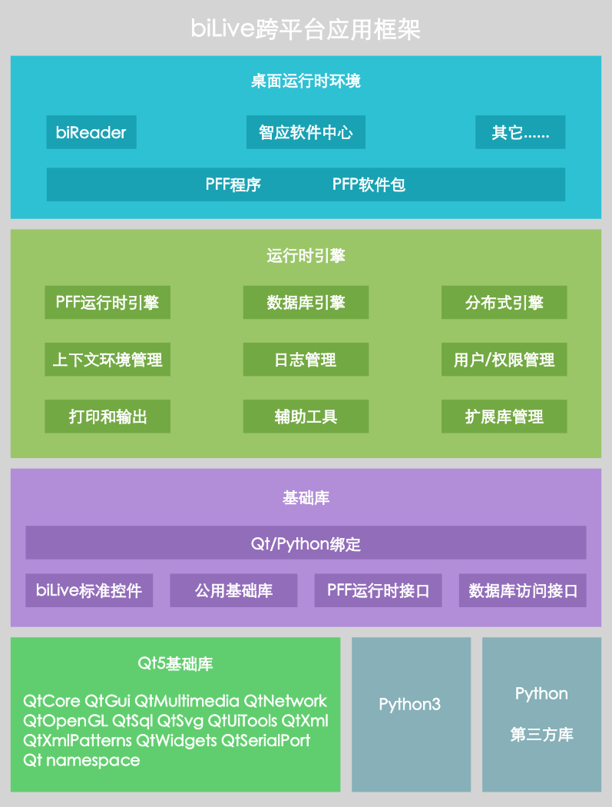

# biLive跨平台应用框架

**biLive跨平台应用框架**（以下简称**biLive框架**）是武汉百利孚信息科技有限公司推出的一个桌面程序应用框架，用于开发跨平台桌面应用程序。

biLive框架发布的应用程序为PFF／PFP格式，具有一次开发和打包、多平台免编译无差别高效运行的特点。

开发者只需要一次编码、一次打包，发布的PFF格式的文件就可以在多种操作系统、多种ＣＰＵ架构的目标机器上运行。前提是在目标机器上已经安装了支持PFF运行时引擎的运行时环境。运行时环境可以是百利孚官方发布的biReader、智应软件中心，也可以是如智龙ＩＤＥ等使用PFF运行时引擎做为插件框架的应用程序。

做为一个创新型的软件应用框架，biLive框架尽管拥有很多技术特性，提供了各种技术手段，解决了很多技术问题，但它并不是为解决某个特定的技术问题而设计的，而是为了创造一个独特的软件世界而设计的，它是我们软件世界观的具体体现。如果只了解它的技术特性和提供的工具，是不能充分了解它的独到之处的。

## 一、biLive的软件世界观

biLive框架有自己独特的架构设计，目标是打造**从整体上更具集成性、更具协同性的软件开发和运行平台**。

### 为什么说是“**从整体上**”？

桌面应用程序的开发框架有很多。但我们经常会发现：“**即使是使用的相同的应用框架，不同的开发者开发出的应用程序之间也很难集成、很难协同**”。

这里“很难集成、很难协同”并不是指具体两个应用程序之间，而是指“任意两个应用程序”之间。

解决“具体两个点”之间的问题的技术手段有很多，解决“任意两个点”之间的问题就需要从应用框架的层次去考虑了。这就是biLive应用框架想要思考和解决的问题，并且也给出了自己的解决方案。

先分析产生这个问题的原因，我们认为主要是两个方面：

- 1、应用程序内部耦合度太高

内部耦合度太高的直接结果就是扩展性受影响。以至于要与其它系统集成，从“扩展自己”这个角度就不方便。大家都不方便“扩展”，集成和协同起来就各种麻烦。解决“两个点”之间的集成的问题与解决“任意两个点”之间的问题的复杂度和需要的工作量呈指数上升。

虽然应用框架通常并不强制开发耦合度高的程序，但同样也不强制开发耦合度低的程序。所以，我们从应用框架层面上就要解决这个问题。

所以我们要提供的解决方案是设计一种“**很容易实现、甚至是强制性的低耦合的应用框架**”。biForm做为集成式开发环境，保证了开发的PFF程序都是符合这个规范的。开发者并不需要了解它是如何实现“低耦合 ”的，对于使用biForm的开发者来说，它就是“很容易实现的 ”。

- 2、应用程序之间的边界感太强

这个与内部耦合度太高也有关系。耦合度高的程序，内部各个功能模块独立性不强，只能在本应用程序内部运行，这些模块抱紧成一团，形成了强烈的应用程序的“边界”。

边界感一方面体现在应用程序的功能组合上，另一方面也体现在其所操作的数据上。比如两个软件都有“收藏夹”的功能，能通用吗？能共享吗？当然具体解决两个软件之间的这个问题也还是容易的，但通常开发这两个软件的开发者，在设计之初是不会考虑这个问题的。另外，如果要实现“所有软件”中的“收藏夹”的共享问题，要怎么办？

所以我们要做的就是“把应用程序的内部打散”。一个完整的应用程序，内部被打散成为一个个PFF程序。这些PFF程序可以到别的应用程序中运行，可以与其它PFF在其它应用程序中进行自由组合，自然每个应用程序的边界感就没有那么强了。

以PFF现在已经发布的应用程序为例，同一个PFF程序，既可以在biReader中做为一个功能模块（表单）运行，也可以做为一个独立的程序，在安装了运行时引擎的机器上独立运行，也可以在其它应用程序（比如智龙IDE）中做为插件运行。而同一个PFF所在的不同宿主程序，因PFF中规范了统一的数据结构，通过我们的分布式引擎，很容易实现不同应用程序之间数据的集成，从而进一步打破应用程序之间的数据边界。而应用程序的使用者，因为应用程序的数据边界的被打破，用户之间的数据边界也被打破了。

所以，为什么说是“从整体上”？

因为这种低耦合、低边界感是由应用框架强制规范化的，开发者在开发之初都不需要考虑这个问题，自然地就达到了这个目标。解决“任意两个点”之间的问题几乎不费力气。解决“具体两个点”之间的问题，与解决“任意两个点”之间的问题，复杂度和实现的难度是差不多的，不会呈指数上升。

所以，我们的应用框架是将所有开发者、所有基于这个框架的应用程序、所有使用这些应用程序的用户，做为一个整体来进行思考的，提供的是“整体上”的解决方案，而不是只解决如何开发一个“有明显边界感”的应用程序，或者只解决具体“两个应用程序”之间如何集成和协同的问题，即使这两类问题也需要解决跨平台等技术问题。

### 集成性的具体体现：

### 1、跨平台

因为是通用的应用框架，需要尽可能满足最广泛的用户群体，因此跨平台是必须要支持的特性。

### 2、跨数据库

用户可以需要使用多种数据库类型，目前底层的运行时引擎是使用的关系型数据库，开发者也可以通过Python库访问其它类型的数据库做为扩展。

### 3、运行时组装和集成（即插即用）

因为应用程序“内部被打散”，而且要“易于扩展”，因此要求PFF程序必须是即插即用的。

这个“打散”和“组合”的过程，是由用户在运行时进行组装的，只在特别的场合，由开发者编写一些适应性的代码。

比如想在现有的系统中增加一个“出差申请单”的功能，找到一个通用的“出差申请单.PFF”就可以用了。但用户还希望这个出差申请单与自己的财务系统进行集成，希望在单据审核完成后，能够自动添加一条“费用申请单”，而这个通用的“出差申请单”中没有这项功能，这时就可以由开发者修改这个PFF或者添加别的PFF来实现这个个性化需求来适应本地系统。

### 4、无限的可扩展性

因为所有使用biLive框架的应用程序都是支持PFF程序的“即插即用”的，所以就自然拥有了无限的可扩展性。

### 协同性的具体体现：

协同性体现在两个方面：

### 1、开发者之间的协同

开发者不需要太多地考虑“怎么协同”，按PFF的开发规范来，自然就容易“协同”。

协同一方面体现在不同的开发者开发的程序，很容易就可以在同一个应用程序或运行时环境中运行，“即插即用”的特性保障了这一点。

另一方面这些PFF程序可以自然地共享数据。使用biForm开发，不同的PFF只要指定相同的数据表，就可以很容易共享数据。通过开发者共享的数据字典，其它开发者就能轻松实现数据共享。

通过biLive框架提供的规范化的应用框架和开发工具，开发者可以做到“无协作或低协作的协同开发”。

### 2、应用程序和用户之间的协同

这一点依赖于我们即将推出的分布式引擎，最终所有基于biLive应用框架的应用程序和用户将形成一个分布式的中去心化的网络。

当然这一点并不是强制性的。目前biReader发布的版本并没有提供这样的功能，将来也还会继续提供这样的版本。用户也可以通过定制化企业版，控制应用程序与其它应用程序以及用户之间的协同性。

## 二、biLive框架整体架构

### １）PFF运行时引擎
PFF运行时引擎负责PFF程序的加载、界面渲染、脚本运行、缓存、销毁、多实例管理、多视图、与其它PFF交互和集成、升级等，为PFF程序的运行提供底层支撑。

### 2）数据库引擎
PFF运行时后台需要数据库，目前可以使用SQLite、MSSQL Server、PostgreSQL、Sybase等，未来也会支持更多种数据库管理系统。数据库引擎对数据库连接、数据表的创建、数据的增删改查等数据库操作都进行了封装，开发者只需要很少的代码即可快速进行与数据库相关的开发。

### 3）分布式引擎
这部分包括分布式数据、分布式事务处理、分布式工作流引擎等。以便将来PFF可在分布式网络环境下运行和通信。这部分还在升级中，目前发布的产品尚未提供这部分功能。

### 4）上下文环境管理
不同PFF有不同的运行时上下文环境，同一PFF也可以有多个实例，因此在运行时需要相互隔离。不同的运行时环境，其所用的Python也需要互相隔离。

### 5）日志管理
运行时环境提供统一的运行日志。

### 6）用户/权限管理
用于多用户环境下，用户账号管理、登录管理、权限管理等。

### 7）打印和输出
biLive框架提供通用的打印、打印预览、多种格式文件输出、数据导入导出等功能。

### 8）辅助工具
提供一些通用的辅助工具，比如程序界面截图、数据记录的收藏等。

### 9）扩展库管理
对Python第三方库进行管理。这部分目前在规划中，目前发布的版本尚未提供这部分功能。

### 10）基础库

这部分包括：
- Qt5和Python3绑定
- biLive标准控件
- 公用基础库
- PFF运行时接口
- 数据库访问接口

biLive框架对Qt5的基础库进行了封装、并与Python3进行绑定，以便可以通过Python3语句访问和调用这些库。

在Qt5的控件基础上，封装了一批biLive标准控件用于界面的可视化快速开发，并对应开放了ＡＰＩ接口。

同时提供了一些通用的公用函数、公用变量、运行日志、数据库访问、用户管理、系统参数、PFF运行时等的API接口。

这些基础库与Qt5、Python3、Python第三方库共同为biLive应用框架提供系统级的基础支持。

### 11）Qt5基础库

biLive框架对Qt5几个主要的库进行了封装，提供了Python脚本访问的接口，并在底层进行Python数据和对象与Qt数据和对象之间的转换。

已经封装的库包括：
- QtCore
- QtGui
- QtMultimedia
- QtNetwork
- QtOpenGL
- QtSql
- QtSvg
- QtUiTools
- QtXml
- QtXmlPatterns
- QtWidgets
- QtSerialPort
- Qt namespace

### 12）Python3基础库及第三方库

biLive框架使用Python3做为编程语言。因此也可以使用大量基于Python3的第三方库。用户也可以自己进行扩展。

## 三、开发工具和运行时环境

百利孚已经开发出多个软件产品，为开发者提供开发调试工具，以及为最终用户提供运行时环境：

### 1）biForm集成式开发环境

biLive框架规范了PFF的标准结构和编程接口，并为此提供了集成式开发环境biForm。开发者使用biForm开发PFF自然具备其天然特性，用户并不需要了解其底层运作原理。

PFF程序使用Python３做为编程语言。biForm用Qt5和Python3开发，为PFF程序提供了集成式开发环境，集成了可视化界面设计器、数据视图设计器、Python脚本编辑器、试运行、调试、打包发布等开发者需要的所有功能。

PFF程序既可以使用Qt5提供的丰富的控件库和底层库，也可以使用众多数量庞大、功能强大的Python第三方库。

### 2）biReader通用运行时环境

biReader是一个允许以多实例方式运行的通用的运行时环境。每个实例为使用这一实例的所有PFF提供一个统一的多文档主窗口环境。不同实例之间的PFF的运行是互相隔离的，也即同一实例中的PFF直接通过PFF运行时引擎进行集成和协同，也可以通过biLive框架中的分布式引擎与其它用户处的其它实例进行集成和协同。

PFF在biReader中是即插即用的，用户随时可以对某个PFF进行升级，或添加新的PFF对原有功能进行扩展。

biReader可使用多种ＤＢＭＳ做为后台数据库，多个终端用户可以通过使用同一个数据源共享数据、同步升级、权限管理等。所以它适合为ＥＲＰ／ＣＲＭ／ＨＲ等管理信息系统提供独立的运行环境。

一个biReader实例可使用多个数据源并在它们之间进行切换，适合用户需要并行使用多个系统的场合。

因为它支持多实例，所以也适合用于为测试和调试PFF程序提供独立的互相隔离的运行环境。

### 3） 智应软件中心

智应软件中心是一个单实例的通用的运行时环境。与biReader最大的不同是，每个PFF以独立的窗口运行。并且智应后台目前只能使用SQLite数据库，暂时不能使用其它数据库。

在ＰＣ端只需要安装智应软件中心，即可双击启动运行PFF／PFP文件。智应软件中心为这些PFF提供统一的运行时环境和管理工具。

## 四、biLive跨平台通用应用程序的发布

目前biLive跨平台通用应用程序有PFF/PFP两种格式。视其功能和应用场合，可以通过以下形式发布：

### １）做为独立的应用程序发布

这种情况下，目标机器上需要安装智应软件中心。

用户双击PFF程序，或使用操作系统提供的“打开”菜单，或通过智应软件中心提供的菜单选择PFF文件，即可运行。

多个PFF程序可以打包成一个PFP程序，一起发布，运行效果和单个运行其中的每个PFF是一样的。PFP主要是为了方便发布和用户操作。

### ２）做为一个功能模块发布

这种情况一般是在biReader中运行，PFF做为一个大的系统的某个子功能模块而存在。比如销售管理系统中，“销售订单”就可以是一个PFF程序，“发货申请单”就可以是另一个PFF程序。用户第一次使用某个PFF时，通过biReader提供的菜单打开PFF文件，就可以运行。首次运行后，PFF文件可以删除掉，以后通过biReader提供的菜单或其它PFF中的引导，就可以调用它。

这种场合也可以使用PFP文件将一组PFF一起进行发布。打开一个PFP文件等同于同时打开多个PFF文件。

用户如有特殊需要，可以对biReader进行定制，比如修改启动画面、修改软件名称、修改主窗口标题等，目前只有百利孚官方提供这些定制服务。定制后的biReader可以做为独立的自用软件或商用软件发布。

### ３）做为插件发布

除了biReader和智应软件中心，biLive框架也可以用在其它软件中，做为插件框架。已经面市的有为龙芯嵌入式开发提供集成式开发环境的智龙IDE。

智龙IDE使用biLive框架做为其插件框架，底层使用了biLive运行时引擎，插件也是PFF格式的文件。

为智龙IDE开发插件，也一样是使用biForm，开发和发布方式与开发其它PFF是一样的。

智龙IDE开放了一些API供Python程序调用，所以在程序中要通过 import IDE 来导入这个专用的模块才能访问这些API。专为智龙IDE开发的插件，在其它运行时环境中，因为不能导入 IDE 模块，可能不能正常运行，除非这个插件没有使用这个模块，或者在程序中对环境进行识别做了容错处理。这一特性，在所有将biLive框架做为插件框架的应用程序中，都是一样存在的。

## 五、主要特性

### 1）跨平台

真正的**一次开发、一次发布、所有平台通用**。

biLive框架下所有应用程序，目前发布的版本支持Windows7/8/10及多个Linux发行版，支持x86_64/AMD64、ARM64、mips64el、loongarch64、申威等多种ＣＰＵ架构类型。技术上也可支持macOS，不过目前尚未发布相应版本。

基于biLive框架的跨平台与Qt的跨平台不同，PFF程序是**完全免编译**的。

在不同操作系统和CPU架构环境下编译Qt程序，光是配置开发环境就有很多事情要做，编译过程中也需要解决很多编译环节的兼容性问题。为适应不同的平台，需要在多个平台上重复整个编译过程，耗时费力。

虽然biLive框架也是使用的Qt为基础，但开发者用Python进行开发就可以了。biLive运行时引擎在PFF程序和操作系统之间建立了一个中间隔离层，提供统一的编译好的Qt库和Python库。因此开发者不再需要进行Qt程序的编译，也不需要解决Python程序跨平台的环境问题，既能方便地使用Qt库和Python，又能更轻松地实现跨平台。

biLive框架提供了通用的跨平台方案，开发者不需要特意考虑软件底层的跨平台兼容性问题，但跨平台本身也是一个复杂、琐碎、充满不确定性的问题。尤其是Linux发行版众多，容易偶发一些细小的差异甚至是系统的BUG，使得程序得不到正确的运行结果。所以，某些应用层面的问题还是需要注意的。比如不同操作系统的文件路径的写法、对注册表等系统级资源的访问等，这些属于应用层面的问题，Qt和Python也提供了很多通用的API，可以尽量采用。

### 2）易于开发

我们提供了强大的集成式开发环境 biForm，提供设计和开发PFF所需要的一切功能：

-“所见即所得”的界面设计器
- 可视化的数据视图设计器
- 功能强大的Python脚本编辑器，支持语法着色、代码补全、函数调用提示
- 试运行环境下Python交互式实时调试工具
- 日志跟踪调试工具
- 一键打包发布
- 内置丰富的图标和图片库
- 自动进行版本管理
- 标准控件库
- Qt5核心库(QtCore, QtGui, QtMultimedia, QtNetwork, QtOpenGL, QtSql, QtSvg, QtUiTools, QtXml, QtXmlPatterns ,Qt namespace,QtWidgets,QtSerialPort)
- Python第三方库(内置50多个第三方库，包括numpy、pygraphviz、matplotlib、pandas、reportlab、crypto等)

### 3）易于发布和升级

Python本身也是跨平台、免编译的。理论上发布Python程序也很容易，因为只要将.py文件复制到目标机器上就行了。但Python程序对环境的依赖性很强，所以实际发布还是要解决很多问题。

与biForm同样采用Qt+Python进行开发的PyQt也是采用 .py 文件发布的方式，也是有相同的问题。

如果程序需要升级，这个过程还要更加复杂。

biLive应用框架和PyQt采用的技术架构不同，最终发布的程序是自已设计的PFF文件。运行时环境中已经准备好了程序运行需要的Python库、Qt库、Python第三方库，开发者只要发布PFF文件就可以了。只有在需要额外的文件（比如某个自用的文件、某个自用的Python库等）的情况下，才需要考虑在目标机器上发布这些文件。

所以基于biLive框架的应用程序，发布也是非常容易的。升级也只需要提供新版本的PFF文件，在运行时环境中运行一下就完成了升级。

