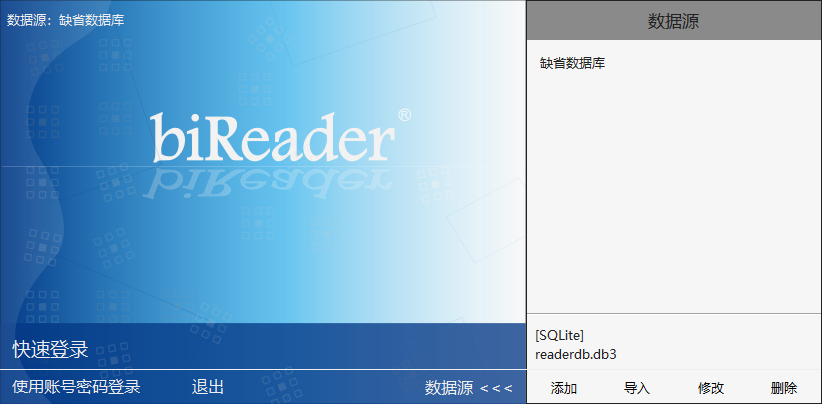
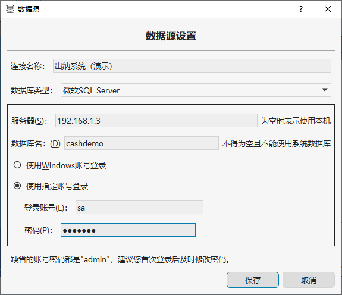
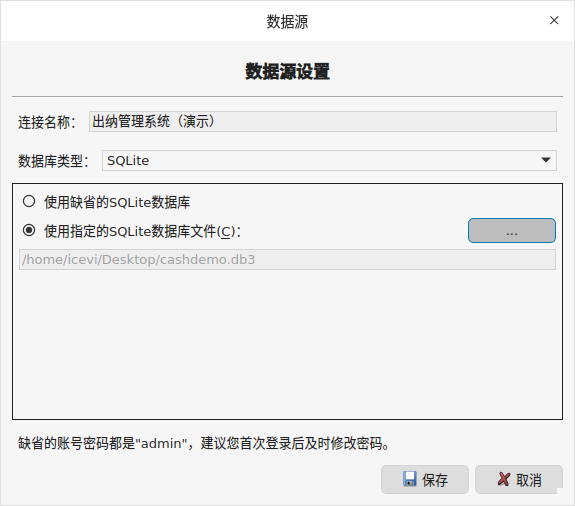
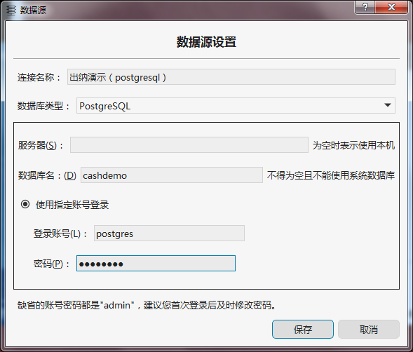
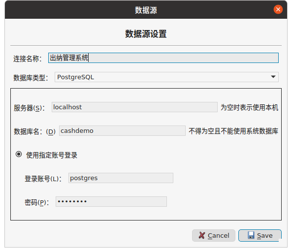
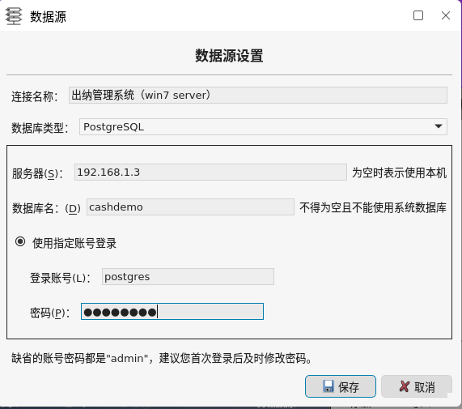

# 出纳管理系统演示说明

“出纳管理系统”是一个简约版的、可以管理多个单位的现金和银行存款账簿的、跨平台的、C/S架构的管理信息系统。

“出纳管理系统”基于我们公司的 [biLive 跨平台应用框架](/bilive/bilive_framework) ，由20个PFF程序组合而成，这些PFF程序都是使用 biForm V3.1 开发的。

本文档介绍如何使用PFP表单包自建数据源，或者使用我们提供的演示数据库来试用这个系统。

---

<h2 id=category>目录</h2>

- [出纳管理系统介绍](#cash)

- [使用PFP应用包自建数据库](#createbyself)

- [演示数据库](#database)

- [用户账号和权限管理](#user)

- [MSSQL演示数据库使用说明](#mssql)

- [SQLite演示数据库使用说明](#sqlite)

- [PostgreSQL演示数据库使用说明](#postgresql)

- [升级和二次开发](#dev)

- [下载资源汇总](#download)

---

<h2 id=cash>出纳管理系统介绍</h2>

[返回目录](#category)

整个系统由多个PFF程序组合而成，如下表格所示：

|       功能模块        |                                        演示重点                                         |
| -------------------- | --------------------------------------------------------------------------------------- |
| 出纳管理系统主控台     | 演示如何通过主控台这种表单集中调用其它表单                                                 |
| 单位资料维护          | 演示使用biLive表单框架开发的数据维护类表单                                                |
| 银行开户行维护        | 演示不使用biLive表单框架的数据维护类表单                                                  |
| 支付方式分类          | 演示不使用biLive表单框架的数据维护类表单                                                  |
| 现金及银行存款账户设置 | 演示使用biLive表单框架开发的数据维护类表                                                  |
| 系统选项              | 演示设计选项设置表单，及如何使用biReader用户账号进行权限设置                               |
| 现金日记账            | 演示使用biLive表单框架开发的数据录入类表单                                                |
| 现金账簿              | 演示报表查询类表单的使用、调用其它表单、调用其它表单地定位到特定记录、打印输出、导出EXCEL文件 |
| 银行存款日记账        | 演示使用biLive表单框架开发的数据录入类表单                                                |
| 银行存款账簿          | 演示报表查询类表单的使用、调用其它表单、调用其它表单地定位到特定记录、打印输出、导出EXCEL文件 |
| 资金报表              | 演示报表类表单、打印、导出EXCEL文件                                                       |
| 资金总表              | 演示报表类表单、打印、导出EXCEL文件                                                       |
| 现金日记账常用摘要     | 录入现金日记账时会自动保存常用摘要，这个表单演示对常用摘要的维护                            |
| 现金日记账常用经手人   | 录入现金日记账时会自动保存常用经手人，并与现金账户挂钩，这个表单演示对常用经手人的维护        |
| 银行日记账常用摘要     | 录入银行日记账时会自动保存常用摘要，这个表单演示对常用摘要的维护                            |
| 银行日记账常用经手人   | 录入银行日记账时会自动保存常用经手人，并与银行账户挂钩，这个表单演示对常用经手人的维护        |
| 出纳扎账              | 演示权限管理                                                                             |
| 报表打印(A4)          | 隐藏的表单，用于“现金账簿”和“银行存款账簿”和报表的格式化打印输出                            |
| 报表打印(A4横)        | 隐藏的表单，用于“现金账簿”和“银行存款账簿”和报表的格式化打印输出                            |
| 初始化                | 只在初始化阶段使用，“主控台”上没有提供调用链接，要通过 biReader 主菜单“应用”来调用           |

“出纳管理系统”通常以PFP表单包形式发布给最终用户，需要在 biReader 中运行 。biReader是一款跨平台支持多种CPU架构的通用的软件运行平台。因此“出纳管理系统”可以在 Windows / Linux 多种发行版环境下使用，并支持 X86_64、AMD64、ARM64、Mip64el、LoongArch64 等多种CPU架构的PC机。后台可使用 SQLite 、 Microsoft SQL Server 2000/2005/2008、PostgreSQL等多种关系型数据库系统。如果使用PostgreSQL数据库在局域网内共享数据源，客户端可以是不同的操作系统、不同的CPU类型混用。请访问 [**下载中心**](/download/index) 下载安装适合您使用的平台的版本。

您可以 [使用PFP应用包自建数据库](#createbyself) 来试用，也可以直接使用我们已经准备好了演示数据的 [演示数据库](#database) 来试用。PFP应用包是跨平台通用的，一个文件可以适用于所有这些平台。演示数据库则需要您按照平台和需求下载不同的演示文件。

- Windows平台下单机或局域网共享数据源，使用MSSQL数据库。请参考 [MSSQL演示数据库使用说明](#mssql) 。

- Windows平台或Linux平台下单机使用，可以使用SQLite数据库或PostgreSQL数据库。请参考 [SQLite演示数据库使用说明](#sqlite) 和  [PostgreSQL演示数据库使用说明](#postgresql)。

- Windows平台或Linux平台下单机或局域网共享数据源，请参考 [PostgreSQL演示数据库使用说明](#postgresql)。

“出纳管理系统”也可以在“智应软件中心”中运行，但因为“智应软件中心”不会提供用户账号和登录管理等辅助功能，且只能使用SQLite数据库，并且没有多文档管理界面，因此通常并不建议在“智应软件中心”中使用。但通过“智应软件中心”可以很方便地通过任务栏菜单、或通过双击PFP/PFF文件快速启动主控台或其中某个PFF程序，如果您喜欢这种运行方式，也可以试试。

提示：演示数据库有使用限制，扎账日期不能晚于 2022年5月1日。

---

<h2 id=createbyself>使用PFP应用包自建数据库</h2>

[返回目录](#category)

自己创建数据库试用“出纳管理系统”操作步骤如下：

1. 下载 [出纳管理系统PFP应用包](https://www.bilive.com/site_media/media/demo/cash_v2.7.PFP)
2. 如果是使用SQLite数据源，启动 biReader ，在启动画面点击“数据源>>>”后，点“添加”，设置 SQLite 数据库文件目录及文件名（最好是使用新文件），保存。如果是使用MSSQL或PostgreSQL数据源，需要先使用MSSQL或PostgreSQL的管理工具创建一个新数据库后，在 biReader启动画面的“数据源”界面“添加”新的数据库并保存
3. 在数据源列表中双击新添加的数据源
4. 点“快速登录”，或点“使用账号密码登录”后使用账号 admin（密码 admin） 登录
5. 在 biReader 的主菜单中选择“应用”-“注册新的软件包”，或在启动后显示的“欢迎”界面点“添加/升级模块”，选择第一步下载的 cash_v2.7.PFP 文件，即可完成应用包的注册

应用包注册后，请先按以下步骤进行初始化。可以使用 biReader 主菜单“应用”-“出纳管理系统”-“初始化”打开“初始化”表单，按提示操作：
1. 单位设置（至少需要输入一个单位资料）
2. 银行开户行维护（至少输入一项）
3. 现金及银行存款账户设置（建议现金和银行存款账户各设置至少一个）

初始化完成后，使用主控台提供的菜单即可录入数据和查看账簿和报表了。

使用 MSSQL 或 PostgreSQL 数据源，可以在局域网中多人共享同一个数据源。软件包中的PFF程序的信息是保存在数据库中的，因此“注册新的软件包”这个操作只在其中一台上进行就可以了。其它电脑登录系统后，会自动从数据库下载 PFF 程序后再在本地运行。因此其它电脑第一次使用某个PFF程序时，biReader会先花少量时间下载PFF程序到本地，以后再使用就是从本地直接调用了。

---

<h2 id=database>演示数据库</h2>

[返回目录](#category)

我们提供的演示数据库中已经准备好了一些数据，下载后不需要进行初始化设置，可立即使用。

使用SQLite数据库，请参考 [SQLite演示数据库使用说明](sqlite) 。

使用MSSQL数据库，请参考 [MSSQL演示数据库使用说明](mssql) 。

使用PostgreSQL数据库，请参考 [PostgreSQL演示数据库使用说明](postgresql) 。

---

<h2 id=user>用户账号和权限管理</h2>

[返回目录](#category)

预设的账号和密码：

| 账号  | 密码  |    用户名     |
| ---- | ----- | ------------- |
| admi | admin | Administrator |
| 001  | 001   | 张三三        |
| 002  | 002   | 钱六六        |

进行用户账号管理，需要使用 admin 账号登录 biReader。在 biReader 启动界面，点“使用账号密码登录”才可以，不能使用“快速登录”。并且只有 admin 可以进行用户账号管理 。

001和002都是由 admin 添加的账号，可以使用 admin 账号登录后进行维护 。admin 是系统预设账号，不能删除。这些账号都可用于登录 biReader，除非设置为“禁用”。

biLive 运行时引擎提供了用户账号管理、密码管理、登录管理，但不会提供针对具体应用进行具体的权限管理，所以针对具体功能的权限管理是由开发者在开发PFF程序时自己实现的。在“出纳管理系统”这个演示系统中，有做简单的演示。在“选项设置”中可以设置进行扎账、反扎账的用户，界面上的“用户”清单是在 biReader 中的“用户管理”中设置的。在“出纳扎账”中，通过  pub.currentUserID() 获取当前用户账号后进行判断，即可进行权限控制。

---

<h2 id=mssql>MSSQL演示数据库使用说明</h2>

[返回目录](#category)

步骤：
1. 下载 [mssql演示数据库](https://www.bilive.com/site_media/media/demo/cashdemo_mssql2005.zip)；
2. 解压cashdemo_mssql.zip文件，使用 MSSQL server 2005 的管理工具，创建一个新的数据库  cashdemo，并使用解压后得到的 cashdemo.bak 还原数据库；
3. 启动 biReader ，在启动画面点“数据源>>>”，如下图所示：

4. 点“添加”，出现以下界面，按您的数据源信息设置MSSQL连接参数（如果服务器是本机，将“服务器”设为空就可以了）：

5. 保存数据源设置，返回数据源列表界面（如果连接不上数据库，保存时会报错）：

6. 双击刚才设置的数据源，biReader会连接这个数据库；
7. 点“快速登录”，或点“使用账号密码登录”使用账号 admin（密码admin）登录后，就可以使用“出纳管理系统”了。

提示：
- 除了使用缺省的账号 admin 登录以外，也可以使用我们预设的其它账号登录，请参考 [用户账号和权限管理](user) 
- 如果在 biReader 启动后看不到“出纳管理系统”的“主控台”，可以用菜单“应用”-“出纳管理系统”菜单调用“主控台”，也可以用“应用”-“设置自动启动的表单”将“主控台”设置为自动启动
- 使用 MSSQL 数据源，可以在局域网中多人共享同一个数据源。可以在“数据源”设置界面将设置项导出后，在其它电脑上导入以简化设置过程
- 我们提供的数据库备份是基于 MSSQL Server 2005的，biReader也支持MSSQL Server 2000和2008，MSSQL Server 2008也可以恢复这个备份文件，MSSQL Server 2000可以参考 [使用PFP应用包自建数据库](#createbyself) 自建数据库进行试用

---

<h2 id=sqlite>SQLite演示数据库使用说明</h2>

[返回目录](#category)

步骤：
1. 下载 [sqlite演示数据库](https://www.bilive.com/site_media/media/demo/cashdemo_sqlite.zip)；
2. 解压cashdemo_sqlite.zip文件，得到 cashdemo.db3 文件，注意所在目录当前用户要有读写权限；
3. 启动 biReader ，在启动画面点“数据源>>>”，如下图所示：

4. 点“添加”，出现以下界面，选择SQLite数据文件为刚才下载得到的cashdemo.db3 文件，并设置数据源名称：

5. 保存数据源设置，返回数据源列表界面：

6. 双击刚才设置的数据源，biReader会连接这个数据库；
7. 点“快速登录”，或点“使用账号密码登录”使用账号 admin（密码admin）登录后，就可以使用“出纳管理系统”了。

提示：
- 除了使用缺省的账号 admin 登录以外，也可以使用我们预设的其它账号登录，请参考 [用户账号和权限管理](user) 
- Linux下需要注意 cashdemo.db3 文件及所在目录当前 Linux 用户是否有读写权限

---

<h2 id=postgresql>PostgreSQL演示数据库使用说明</h2>

[返回目录](#category)

1. 下载 [PostgreSQL演示数据库](https://www.bilive.com/site_media/media/demo/cashdemo_pg.zip) ，解压得到文件 cashdemo_pg.bak（假设文件在/home/postgres/download目录下）；
2. 安装并配置好 PostgreSQL ，并启动服务。详细步骤参考 [PostgreSQL安装和配置指南](/demo/postgresql)；
3. 参考以下步骤创建数据库 cashdemo，并从 cashdemo_pg.bak 还原数据（其中的目录改为本机使用的目录）；

``` shell

#sudo -i -u postgres
#psql
postgres=#create database cashdemo;
postgres=#\q
#cd /home/postgres/download
#psql cashdemo < cashdemo_pg.bak

```

4. 启动 biReader ，在启动画面的“数据源”中添加新的数据源，参考以下示例：
如果是连接本机，“服务器”一栏一般用空字符串或“localhost”。如果要连接其它服务器，需要填写服务器的IP地址。





设置后，点“保存”，如果连接不上会报错。如果连接成功，会返回到启动画面；

5. 在启动画面右侧的数据源清单中，双击刚才添加的数据源，biReader会开始连接这个数据库；
6. 点“快速登录”，或点“使用账号密码登录”使用账号 admin（密码admin）登录后，就可以使用“出纳管理系统”了。

提示：
- 服务器和客户端，可以混合使用不同的CPU架构和操作系统。也即不同平台的用户可以通过 biReader 共享使用同一个 PostgreSQL 数据源；
- 局域网访问连接 PostgreSQL 服务器，缺省的安装一般是不能连接的，需要在服务器端进行一些设置，请参考 [PostgreSQL安装和配置指南](/demo/postgresql?id=share)；
- 如果连接参数设置正确，但 biReader 连接数据库不成功，可以用 ```psql``` 命令连接进行测试来排查环境问题。如果您的Linux发行版没有安装 postgresql-client ，可能需要先手动安装一下。

---

<h2 id=dev>升级和二次开发</h2>

[返回目录](#category)

基于 biLive 应用框架独特的架构，“出纳管理系统”也非常容易升级和进行二次开发，以便对它进行升级、扩展，或与其它系统进行集成。您可以通过以下几种方式体验这个过程。

- 通常二次开发需要访问原系统的数据，比如开发一个新的报表。下载 [出纳管理系统数据结构](https://www.bilive.com/site_media/media/demo/cash_structs.zip) 。在 biForm 中导入其中您需要访问的数据表，基于此开发并发布PFF程序，就可以进行“出纳管理系统”的二次开发。发布的PFF程序，可以直接用 biReader 打开运行，或者和其它PFF一起打包到PFP中一起发布。

- 您也可以下载 [出纳管理系统所有PFF文件](https://www.bilive.com/site_media/media/demo/cash_v2.7_pffs.zip)，用您修改过的新的PFF文件替换掉原来的同名文件。用我们提供的 [PFP打包工具](/pfp/tools)，创建一个新应用包。如果要替换原来的应用包，将UUID设置为“{99c0e18d-e10c-4130-bcec-0d63ac31686d}”，版本号改为大于我们的演示程序使用的 2.7。然后打包生成PFP文件。在 biReader 中注册打包生成的PFP文件，可以体验如何进行整个应用包的升级。升级过程中，未修改的PFF程序不会升级，系统只会升级改过的那部分。注意UUID要按上面这个进行设置，否则 biReader 会认为是另外一个系统。也可以在包中添加其它您自己开发的PFF程序。比如您可以在打包时，用您自己开发的“我的主控台.PFF”替换掉我们提供的“主控台.PFF”，表单的UUID可以不一样，在PFP打包工具中将主控台设置为您的PFF程序就可以了；

- 在局域网中共享数据源时（比如使用MSSQL或PostgreSQL数据库），在一台上对PFF程序/PFP应用升级后，其它PC端使用的PFF程序也都会跟着升级。如果其它PC端正在使用升级中PFF程序，会在下次再运行这个PFF程序或biReader时才加载升级后的新版本。

---

<h2 id=download>下载资源汇总</h2>

[返回目录](#category)

本页面提供的所有下载资源清单：

|          内容          |                                  下载链接                                   |               说明                |
| ---------------------- | --------------------------------------------------------------------------- | -------------------------------- |
| 客户端安装程序下载      | [下载](/download/index)                                                     | 所有平台的客户端软件下载地址       |
| 出纳管理系统PFP应用包   | [下载](https://www.bilive.com/site_media/media/demo/cash_v2.7.PFP)          | 试用自建数据库                    |
| 出纳管理系统所有PFF文件 | [下载](https://www.bilive.com/site_media/media/demo/cash_v2.7_pffs.zip)     | 用于二次开发                      |
| 出纳管理系统数据结构    | [下载](https://www.bilive.com/site_media/media/demo/cash_structs.zip)       | 用于二次开发                      |
| PostgreSQL演示数据库   | [下载](https://www.bilive.com/site_media/media/demo/cashdemo_pg.zip)        | 已有演示数据的PostgreSQL数据库备份 |
| sqlite演示数据库       | [下载](https://www.bilive.com/site_media/media/demo/cashdemo_sqlite.zip)    | 已有演示数据的SQLite数据库备份     |
| mssql演示数据库        | [下载](https://www.bilive.com/site_media/media/demo/cashdemo_mssql2005.zip) | 已有演示数据的MSSQL2005数据库备份  |
| PFP打包工具            | [下载](https://www.bilive.com/site_media/media/tools/PFPtools.PFF)          | 用于二次开发后发布自己的PFP应用包  |
