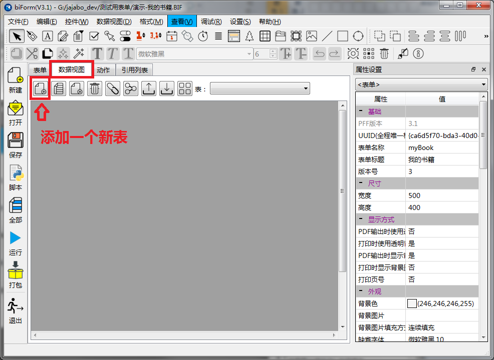
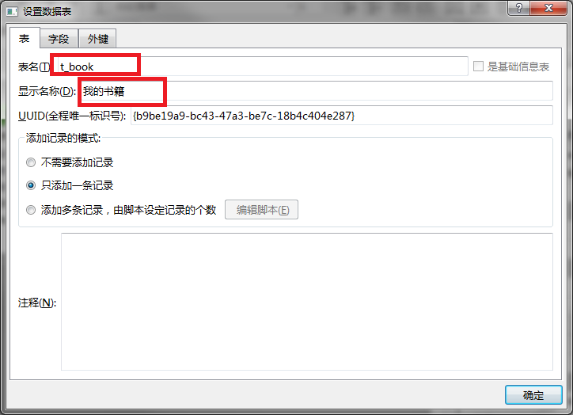
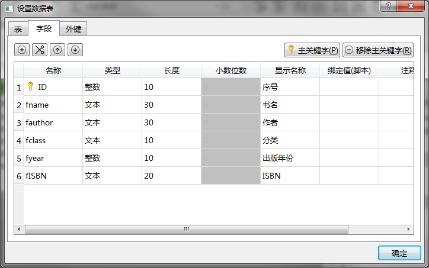
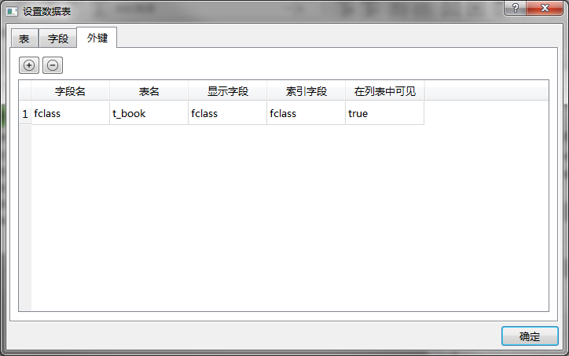

# 设计数据视图

还记得我们当初设计的表结构吗？当然这意味着我们这个表单是需要使用数据库的。在 biForm 中，数据视图用来描述这个表单所用到的所有数据表的表结构及相关属性。

我们再看一下表结构：

<table>
	<tr>
		<th>字段</th>
		<th>说明</th>
	</tr>
	<tr>
		<td>书名</td>
		<td>文本型字段</td>
	</tr>
	<tr>
		<td>作者</td>
		<td>文本型字段</td>
	</tr>
	<tr>
		<td>分类</td>
		<td>文本型字段，从“小说/历史/科学/技术”这几项中取值</td>
	</tr>
	<tr>
		<td>出版年份</td>
		<td>整数型字段</td>
	</tr>
	<tr>
		<td>ISBN</td>
		<td>文本型字段</td>
	</tr>
</table>

在 biForm 中，我们需要在主窗口的“数据视图”分页进行数据表的设计，如下图所示：

点击工具栏上的“添加一个新表”图标，弹出“设置数据表”的对话框，按界面指导分别进行设置。

## 设置数据表的主要属性

其中**表名**是用于在数据库中创建实体表时使用的，因此只允许修改数字、字母或下划线。

**显示名称**是用于在最终用户处使用时，界面上某些地方会使用它来显示的，因为需要使用较为友好的名称。

**UUID**是 biForm 自动生成的，一般不需要手工修改，也不建议对之进行修改。

**添加记录的模式**表示“针对一次保存操作，这个表要添加几条记录”，在本例中，我们希望是每次表单界面显示 t_book 表的一条记录，录入记录时，也是一次录入一条记录，所以这里需要选择“只添加一条记录”。另外，这个表单是与 t_book 表记录对应的，在 biForm 中称 t_book 表为它的“主表”，而在 biForm 中，“主表”只能是每次“只添加一条记录”，所以这一属性也只能选择这个选项。

## 设置字段

按上文中的表结构，我们设置了各个字段，但是另外添加了一个字段“ID”做为主关键字。

在这个表单中，t_book 是主表，所以必须要有主关键字，且只能设置一个字段为主关键字。

字段的**显示名称**最好使用比较友好的名称，因为在最终用户使用时，会看得到这个名称。

**绑定值（脚本）**属性也是需要设置的，在下一步[编写脚本](guides/first_form_3)中会再详细讲述。

## 设置外键

在 biForm 中，“外键”含义与一般在数据库管理系统（DBMS）中的外键的含义有点类似，但其实是不同的概念。

在本例中，我们设置一个外键，如下图所示：

1. **外键**用于指定当前这个表（本例中为t_book）的某个字段，与另外的表的某个字段的之间的关联关系。

如果不设置这个外键，在对这个表单的记录进行查询时，biForm会让用户直接输入需要搜索的文字内容，而不是使用一个下拉列表框提示用户在已有的值的范围内进行选择。

在本例中，添加的这个外键，表示在针对 fclass 这个字段进行查询时，以 t_book 表的 fclass 字段的值（去除重复）显示下拉列表框的项目。以 SQL 语句来描述则更简单，就是：

	select distinct fclass ,fclass from t_book 

两个字段一个用于“显示文字”，一个用于“值”。在本例中，因为 fclass 直接是以文字内容写入的，所以显示文字和值都是用这个字段了。

2. 可以将外键设置为关联到自己，如本例中，关联的表名也是 t_book 自己

3. 在对 t_book 的记录进行添加、修改、删除等操作时，biForm 中的外键设置**不会**起到任何约束作用，它只在显示列表、设置查询过滤条件等地方起到一些辅助作用

4. biForm 不会要求外键对应的字段建立索引，但因为通常会在查询和过滤时使用这些字段，对相关字段建立索引，对提升效率是有帮助的。在本例中，不对 t_class 字段建立索引是完全没问题的

5. **在列表中可见**表示“在显示 t_book 的记录列表时，fclass 字段的值是否可见”。在某些情况，某个字段的值是内部的编号，但在列表中可能只希望显示出“名称”等友好性较好的内容，比如表中保存的是“部门编号”，需要关联另外一个表“部门资料”带出“部门名称”，就可以将这个属性设置为“false”，这样，“部门编号”就是不可见的，会按照外键的设置，带出“部门资料”这个表“部门名称”显示在列表中。本例中，fclass 字段本来就是文字型的内容，因此直接显示就可以了，所以这个属性设置为 true 就可以了

## 表单的“主表”属性

表结构已经定义好了，我们还需要设置这个数据表与这个表单之间的关系。

在这个例子中，这个表单就是用于处理 t_book 这个表的，所以，我们将表单的属性“主表”设置为对应 t_book 这个表。在”属性设置“中，设置”表单“这个对象的属性值，如下所示：

<table>
	<tr>
		<th>属性</th>
		<th>值</th>
	</tr>
	<tr>
		<td>主表</td>
		<td>t_book</td>
	</tr>
</table>

以上，就是这个表单与数据视图相关的所有设置了。

下一步，就需要设置表单上的控件与数据视图之间的对应关系了，或者换句话说，就是用户通过表单上的控件如何实现存取数据，这一步需要通过 Python 脚本来实现，请看下一步：[编写脚本](guides/first_form_3)。

