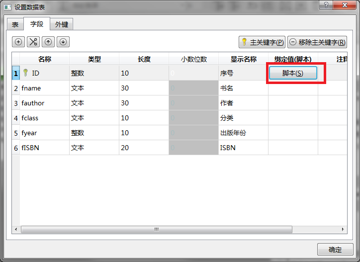
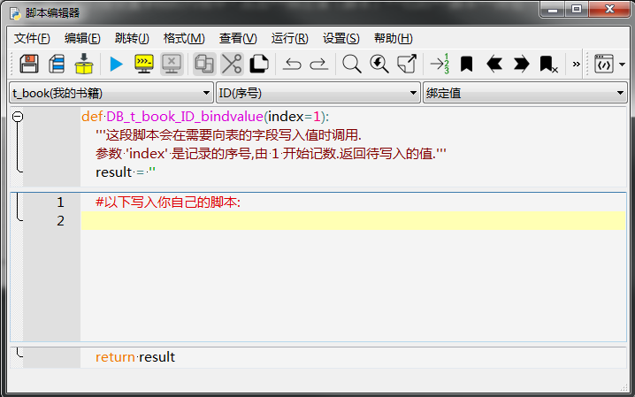
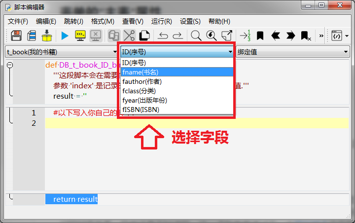
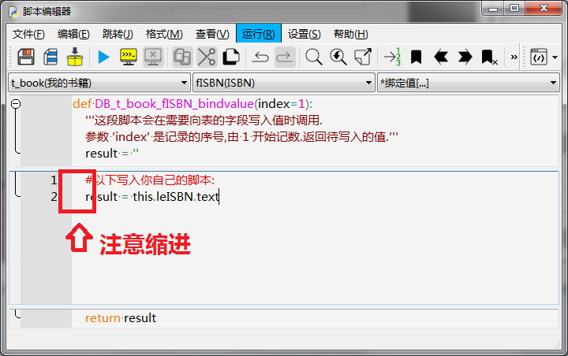
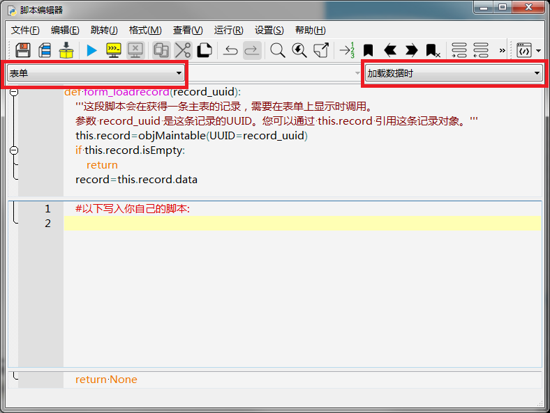
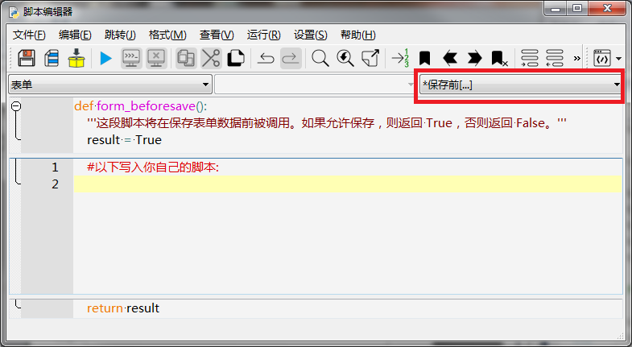

# 编写脚本

上一步，我们已经设计好了表单的界面和数据视图，这一步，我们通过脚本来实现它们之间的对应关系。

在开始编写脚本之前，有两点需要强调一下：

1. biForm 最新版本 V3.1 使用的是 Python 3.6 

2. biForm 中只使用 TAB 进行缩进，不支持使用空格的缩进格式

## 如何访问表单上的控件

还记是我们给每个控件都设置了“控件名称”的吗？访问表单上的控件，可以直接用 `控件名称` 来访问，也可以用 `this.控件名称` 来访问。访问表单这个对象本身则用 `this.form`。

## 各个字段如何赋值

通过对**数据视图**的设置，我们已经知道了， biForm 在保存一条记录时，会往 t_book 表里添加一条记录，但 t_book 每个字段的值是怎么样的？这一点就需要通过 Python 脚本来进行处理。

在 biForm 中，我们在数据表的字段列表中，点击某个字段**绑定值（脚本）**栏的**脚本**按钮就可以进入脚本编辑器，如下图所示：



进入脚本编辑器：



上图中是为字段 ID 赋值的缺省脚本，分成上中下三部分，这三部分合起来就是一个完整的 Python 函数定义：

``` python
def DB_t_book_ID_bindvalue(index=1):
	'''这段脚本会在需要向表的字段写入值时调用.
	参数 'index' 是记录的序号,由 1 开始记数.返回待写入的值.'''
	result = ''
	#以下写入你自己的脚本:

	return result
```

这个是 biForm 默认生成的函数.如果我们不写自己的脚本，t_book的ID字段返回的结果就是一个空字符串。

在 biForm 中，如果主关键字不写脚本，或返回空字符串，运行时会自动生成主关键字。在本例中，ID字段是整数型的，biForm就会自动从1开始自动生成编号。如果不希望使用 biForm 的这项功能，可以自己写脚本来实现。

在本例中，我们不修改ID字段的返回值，让 biForm 自动生成编号。

在**脚本编辑器**中，按下图所示在字段的下拉列表框中选择其它字段：



每个字段分别从界面上各对应的控件取值，如下表格所示写入脚本：

<table>
	<tr>
		<th>字段</th>
		<th>脚本</th>
		<th>说明</th>
	</tr>
	<tr>
		<td>fname 书名</td>
		<td>result = this.leName.text</td>
		<td>取 leName 控件中输入的文本</td>
	</tr>
	<tr>
		<td>fauthor 作者</td>
		<td>result = this.leAuthor</td>
		<td>取 leName 控件中输入的文本</td>
	</tr>
	<tr>
		<td>fclass 分类</td>
		<td>result = this.cbClass.currentText</td>
		<td>取 cbClass 下拉列表当前选择的文本</td>
	</tr>	
	<tr>
		<td>fyear 出版年份</td>
		<td>result = this.spYear.value</td>
		<td>取 spYear 控件的值</td>
	</tr>
	<tr>
		<td>fISBN ISBN</td>
		<td>result = this.leISBN.text</td>
		<td>取 leISBN 控件中输入的文本</td>
	</tr>
</table>

**要注意脚本的缩进**，如下图，自己写的脚本前都是有缩进的：



通过以上的脚本， biForm 就知道在保存一条记录时，如何为各个字段赋值了。
	
## 如何显示一条记录的内容

记录保存后，我们还需要查询记录，并在表单上显示记录的内容。我们需要编辑“表单”的“加载数据时”脚本来完成这个对应关系。



如上图，我们在脚本编辑器里选择“表单”-“加载数据时”，这里也是一个缺省的函数定义，合起来就是下面这样。

``` python
def form_loadrecord(record_uuid):
	'''这段脚本会在获得一条主表的记录，需要在表单上显示时调用。
	参数 record_uuid 是这条记录的UUID。您可以通过 this.record 引用这条记录对象。'''
	this.record=objMaintable(UUID=record_uuid)
	if this.record.isEmpty:
		return
	record=this.record.data
	#以下写入你自己的脚本:

	return None
```

要注意的是， biForm 在处理数据表时，会自动为所有表都再加上两个字段 UUID 和 lastUpdated，如下表：

<table>
	<tr>
		<th>字段</th>
		<th>内容示例</th>
		<th>说明</th>
	</tr>
	<tr>
		<td>UUID</td>
		<td>{ad216060-9081-483b-9fe6-fdf8ea6829fd}</td>
		<td>每条记录对应一个唯一的ID</td>
	</tr>
	<tr>
		<td>lastUpdated</td>
		<td>2018-08-18 20::00 :08</td>
		<td>文本型字段，为这条记录最后被修改的日期和时间，格式固定为 yyyy-MM-dd HH&ensp;:mm :ss</td>
	</tr>
</table>

函数 form_loadrecord 的参数 record_uuid 就是这条记录的 UUID 。

这个函数体中第一段已经定义了一些变量，如 `this.record` 是 t_book 表的一个记录对象，通过访问它的属性就可以获取这条记录各个字段的值。 

先看下 `this.record` 对象几个主要的属性（其它属性参考详细的开发文档）：

<table>
	<tr>
		<th>属性</th>
		<th>说明</th>
	</tr>
	<tr>
		<td>ID</td>
		<td>字段ID的值</td>
	</tr>
	<tr>
		<td>fname</td>
		<td>字段fname的值</td>
	</tr>
	<tr>
		<td>fauthor</td>
		<td>字段fauthor的值</td>
	</tr>
	<tr>
		<td>fclass</td>
		<td>字段fclass的值</td>
	</tr>
	<tr>
		<td>fyear</td>
		<td>字段fyear的值</td>
	</tr>
	<tr>
		<td>fISBN</td>
		<td>字段fISBN的值</td>
	</tr>
	<tr>
		<td>UUID</td>
		<td>字段UUID的值</td>
	</tr>
	<tr>
		<td>lastUpdated</td>
		<td>字段lastUpdated的值</td>
	</tr>
	<tr>
		<td>data</td>
		<td>以数组的形式返回所有字段的值，数组内元素的顺序是表中字段的顺序</td>
	</tr>
</table>

在“加载数据时”脚本中，我们可以按自己觉得方便的方式获得字段的值，然后在控件中显示。

比如下面几种方式都是一样的效果，都是用来在控件 leName 中显示“书名”的：

``` python
	this.leName.text = this.record.fname

	this.leName.text = record[1]

	this.leName.text = this.record.data[1]
```

我们就采用第一种方法，在“加载数据时”脚本中，把所有需要显示的内容都处理一下，最终的脚本如下：

``` python
	this.leName.text = this.record.fname
	this.leAuthor.text = this.record.fauthor
	this.cbClass.setCurrentText(this.record.fclass)
	this.leISBN.text = this.record.fISBN
	this.spYear.value = this.record.fyear
```
	
## 保存前的校验

保存前我们需要判断一下数据的有效性，在本例中我们简化一下，只判断一下各个字段是否为空就可以了。

在**脚本编辑器**中，转到“表单”的“保存前“脚本，如下图：



可以看到缺省的函数定义是这样的：

``` python
def form_beforesave():
	'''这段脚本将在保存表单数据前被调用。如果允许保存，则返回 True，否则返回 False。'''
	result = True
	#以下写入你自己的脚本:

	return result
```
	
在我们要添加的脚本中，先判断了书名、作者、ISBN的内容是否为空，如果有某项为空，就弹出对话框提示一下用户，然后返回 False，就会取消保存操作。

我们添加的脚本如下：

``` python
	if len(this.leName.text)==0:
		pub.infoMsgBox(this.form.caption,'书名不得为空！')
		return False
	if len(this.leAuthor.text)==0:
		pub.infoMsgBox(this.form.caption,'作者不得为空！')
		return False
	if len(this.leISBN.text)==0:
		pub.infoMsgBox(this.form.caption,'ISBN不得为空！')
		return False
```

## 记得保存一下

biForm 保存的设计时表单文件后缀名是.BIF，记得保存一下！

## 可以用了！

经过以上的几个步骤，这个表单已经可以用了，下一步我们就[试运行](guides/first_form_4)一下看看。


