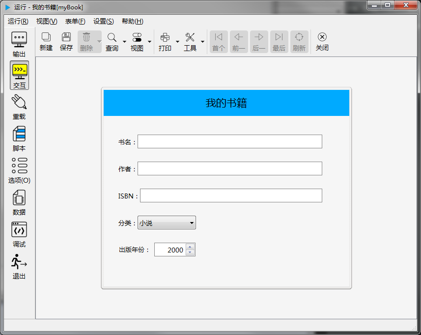
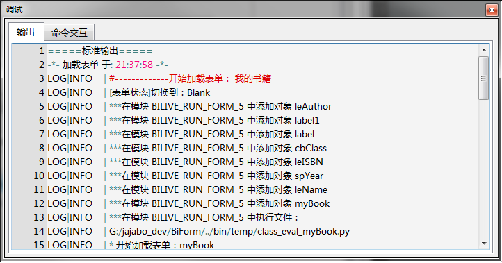
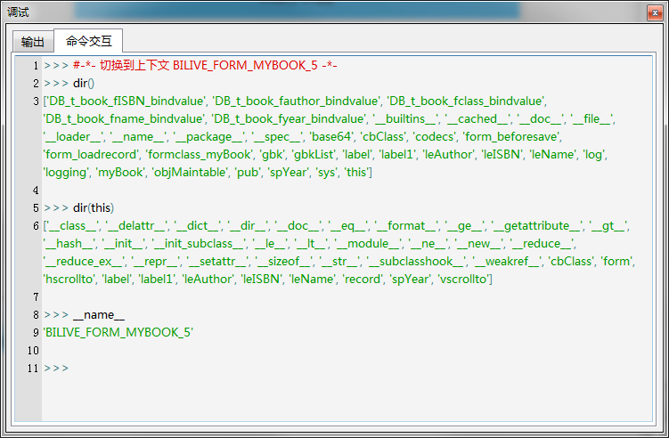

## 试运行

biForm 中按**F5**就可以试运行一下。



窗口显示了我们设计的表单界面。试着录入些数据，工具栏上的功能可以试一下。

在试用过程中，可以点击左侧工具栏上的**调试**按钮，查看运行时输出的LOG信息，或使用 Python 脚本进行调试。

下图显示的是输出的LOG信息，如果我们写的脚本有误，可以在这里查看到错误信息：



下图显示如何使用 Python 脚本进行调试：



命令交互窗口与 Python 的 IDLE 用法类似。输入 Python 语句，会逐条执行立即返回结果。

需要注意一下这个交互窗口对应的 Python 模块的上下文环境。通过查看 __name__ 的值，我们可以看到它并不是 Python 的主模块，而是一个名为 'BILIVE_FORM_MYBOOK_5' 的模块，这是biForm为每个表单单独创建的一个模块。

在命令交互窗口，可以访问表单对象、表单上各个控件对象、公共变量、公用函数等，以及我们添加过脚本的那些函数。

## 访问表单对象

表单对象指的是“我的书籍”这个表单自己。在 biForm 中通过 this.form 来访问。

比如我们通过脚本 `this.form.save()` 就等于使用鼠标按下“保存”按钮。而 `this.form.caption` 返回这个表单的标题，在本例中就是“我的书籍”。

## 访问控件

访问控件可以直接用 `控件名称` 来访问，也可以用 `this.控件名称` 来访问。

比如 `this.leName.text` 返回“书名”这个控件中用户输入的文本，`this.leName.width` 返回它的宽度。

## 访问公共变量和公共函数

比较常用的公共变量，比如 log 对象，用于输出日志信息，pub 对象集中了很多 biForm 的一些公共函数。

## 调用我们添加过脚本的那些函数

还记我们添加过哪些脚本吗？每段脚本其实都是一个函数的一部分，在本例中，我们修改了数据表各个字段的**绑定值**脚本，表单的**保存前**脚本，表单的**加载数据时**脚本，我们也可以通过函数名直接调用这些函数。

比如 

``` python
DB_t_book_fname_bindvalue(1) #字段 fname 的绑定值
form_beforesave() #表单的"保存前"脚本
form_loadrecord('xxxxxx') #表单的"加载数据"脚本

```

## 信号和槽

biForm 底层是使用Qt开发的，也继承了Qt中的信号和槽的概念，具体的概念可以参考Qt相关的文档。

在 biForm 中，我们可以用以下的语句连接信号和槽：

## 有用的 help() 方法

表单对象、表单上的控件对象等由 biForm 创建的对象，很多都有**help**方法。这个方法用来列出所有这个对象的属性、方法、信号、槽等。在我们开始学习这些使用这些对象时，这个方法会很有帮助。

比如 leName 这个控件，我们用

``` python
>>> print(leName.help())
```

得到以下结果：

``` 
--- lineEditDelegate ---
Properties:
objectName (QString )
showType (int )
tabOrder (int )
visible (bool )
geometry (QRect )
x (int )
y (int )
pos (QPoint )
size (QSize )
width (int )
height (int )
vAlign (int )
hAlign (int )
rect (QRect )
focus (bool )
toolTip (QString )
statusTip (QString )
whatsThis (QString )
reloadWhenCreateNew (bool )
acceptDrops (bool )
dragEnabled (bool )
tag (QString )
showInForm (bool )
showInPDF (bool )
showInPrinter (bool )
updatesEnabled (bool )
maxwidth (int )
maxheight (int )
minwidth (int )
minheight (int )
caption (QString )
editorFont (QFont )
editorBackColor (QColor )
editorForeColor (QColor )
editorBorderColor (QColor )
margin (int )
maxLength (int )
editorBorderStyle (int )
captionPosition (int )
shadow (int )
editorFillStyle (int )
foreground (QColor )
background (QColor )
showBorder (bool )
borderColor (QColor )
borderWidth (int )
borderStyle (int )
vAlign (int )
hAlign (int )
font (QFont )
fillStyle (int )
enabled (bool )
isPWD (bool )
inputMask (QString )
text (QString )
displaytext (QString )
defaultVal (QString )
editorVAlign (int )
editorHAlign (int )
readOnly (bool )
Slots:
QString help()
QString className()
deleteLater() -> void
setFullScreen() -> void
quitFullScreen() -> void
setSizePolicy(QSizePolicy policy) -> void
showBalloon(QString msg) -> void
showValidBalloon() -> void
hideBalloon() -> void
setShowInForm(bool v) -> void
setShowInPDF(bool v) -> void
setShowInPrinter(bool v) -> void
setReloadWhenCreateNew(bool v) -> void
isNull() -> bool
toTop() -> void
toBottom() -> void
repaint() -> void
show() -> void
hide() -> void
setMaxWidth(int v) -> void
setMaxHeight(int v) -> void
setMinWidth(int v) -> void
setMinHeight(int v) -> void
setAcceptDrops(bool v) -> void
setDragEnabled(bool v) -> void
setUpdatesEnabled(bool v) -> void
startTimer(int interval) -> int
killTimer(int id) -> bool
killAllTimer() -> void
timers() -> QStringList
startSingleShot(int interval) -> void
setFocus(bool v) -> void
setEnabled(bool v) -> void
setDisabled(bool v) -> void
setVisible(bool v) -> void
setFont(QFont v) -> void
setGeometry(QRect v) -> void
setX(int v) -> void
setY(int v) -> void
setPos(QPoint v) -> void
setSize(QSize v) -> void
setWidth(int v) -> void
setHeight(int v) -> void
setToolTip(QString v) -> void
setStatusTip(QString v) -> void
setWhatsThis(QString v) -> void
setHAlign(int v) -> void
setVAlign(int v) -> void
setBorderStyle(int v) -> void
setFillStyle(int v) -> void
setShowType(int v) -> void
setBorderWidth(int v) -> void
setShowBorder(bool v) -> void
setBorderColor(QColor v) -> void
setBackground(QColor v) -> void
setForeground(QColor v) -> void
setEditorFont(QFont v) -> void
setEditorBorderColor(QColor v) -> void
setEditorForeColor(QColor v) -> void
setEditorBackColor(QColor v) -> void
setCaption(QString s) -> void
setMargin(int w) -> void
setMaxLength(int w) -> void
setEditorFillStyle(int w) -> void
setShadow(int w) -> void
setEditorBorderStyle(int w) -> void
clear() -> void
copy() -> void
cut() -> void
paste() -> void
redo() -> void
undo() -> void
selectAll() -> void
setText(QString t) -> void
setIsPWD(bool w) -> void
setDefaultVal(QString s) -> void
setInputMask(QString s) -> void
setEditorVAlign(int w) -> void
setEditorHAlign(int w) -> void
setReadOnly(bool v) -> void
setIntValidator(intValidatorDelegate validator) -> void
setDoubleValidator(doubleValidatorDelegate validator) -> void
Signals:
destroyed(QObject*)
destroyed()
objectNameChanged(QString)
cursorPositionChanged(int,int)
editingFinished()
returnPressed()
selectionChanged()
textChanged(QString)
textEdited(QString)
```


