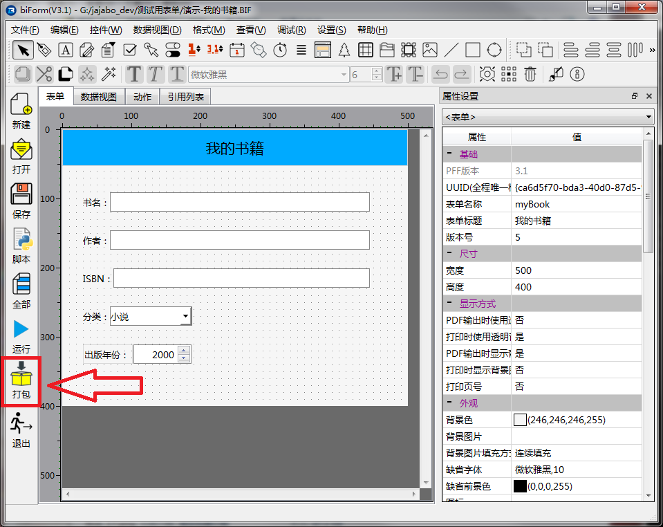
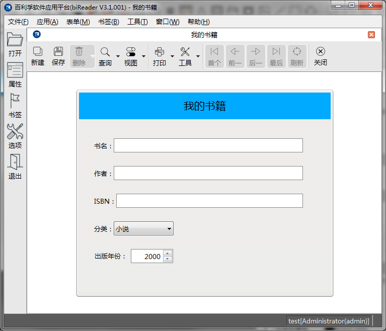

## 打包发布

biForm 试运行OK之后，就可以打包发布了。

biForm 发布的文件被称为“便携式表单文件”，点击左侧工具栏上的“打包”按钮就可以了，生成的文件扩展名是.PFF。

PFF文件需要运行时环境**百利孚软件应用平台**的运行时引擎 **biReader** 才可使用。目前也是唯一的PFF文件的运行时平台。

访问[百利孚软件应用平台官方网站](https://www.bilive.com)下载安装最新版本的 biReader。

biReader 是需要数据库的，缺省情况下使用 SQLite 数据库。即使你开发的应用不需要使用数据库，biReader的运行也需要数据库的支持。目前 biReader V3.1 支持 SQLite 或 MSSQL Server 2000/2005/2008 。一般开发测试，就用缺省数据库就可以了。如果需要使用MSSQL系列，可以在启动画面设置好数据源。

进入主窗口，在主菜单“文件”中选择“打开”，选择刚才生成的PFF文件就可以使用了。

比如以下就是打开我们做的这个表单”我的书籍“之后的情况：

关于 biReader 的使用方法参考网站上的文档，这里就不详细讲解了。

