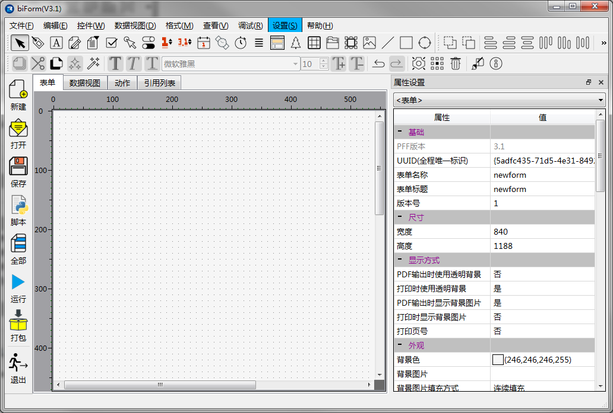
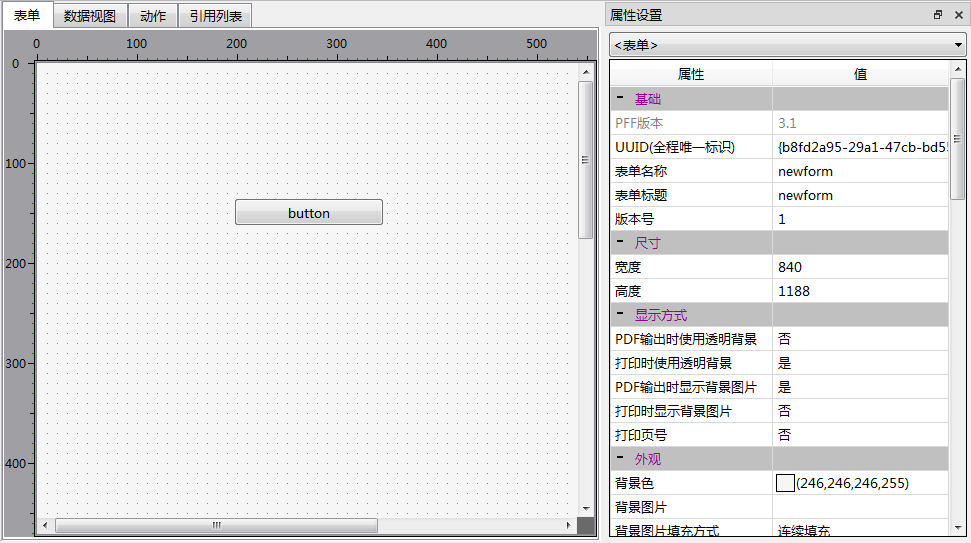
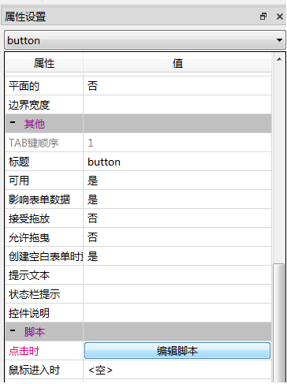
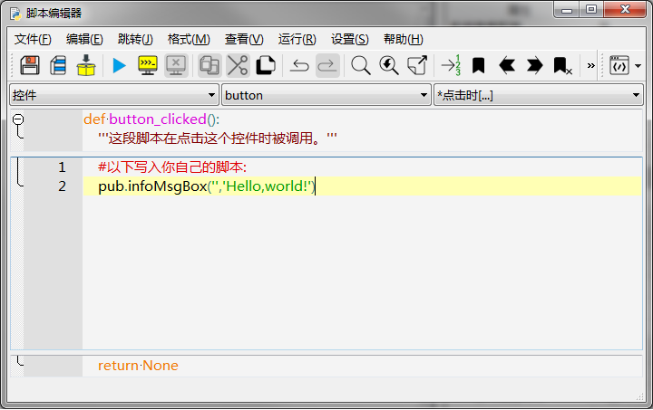
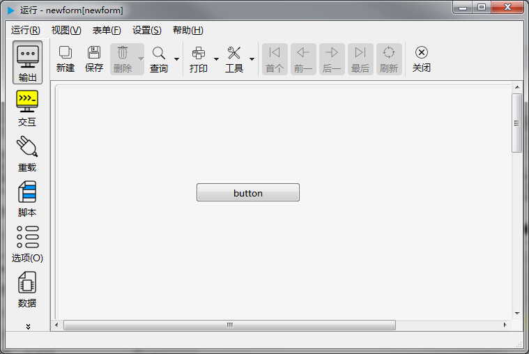
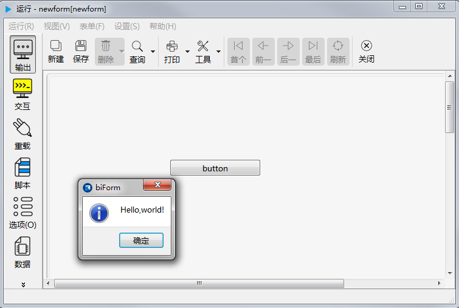

# Hello,world!

尝试一门新的语言或开发工具，先做一个“Hello,world!”怎么样？

我们就来看看用biForm要怎么做。

## 启动biForm

主窗口缺省就是一个空白的表单，中央的空白区域用于设计表单的界面。

## 添加一个按钮控件

点击工具栏上的“按钮”图标，如下图：

然后在表单界面设计区域的空白处点击一下，就可以添加一个“按钮”控件。

## 写第一行代码

选中这个按钮，在属性编辑器中找到“脚本-点击时”这一行，

点击“编辑脚本”进入脚本编辑器。

在脚本编辑器中写下第一行代码：

    pub.infoMsgBox('','Hello,world!')

pub是biForm的公共函数模块。

infoMsgBox用于弹出一个对话框，第一个参数是对话框标题，如果是空字符串的话，会使用缺省的标题，第二个参数是对话框中要显示的信息。

要注意前面的缩进。在biForm中缩进都**统一用Tab**，而**不允许**使用空格进行缩进。

## 来！运行一下！

在biForm中就可以直接试运行，按**F5**，就会打开新的窗口，新窗口中就会加载我们刚才设计的这个表单：

点击按钮，弹出对话框：

这就是我们用 biForm 做的“Hello,world!”。

