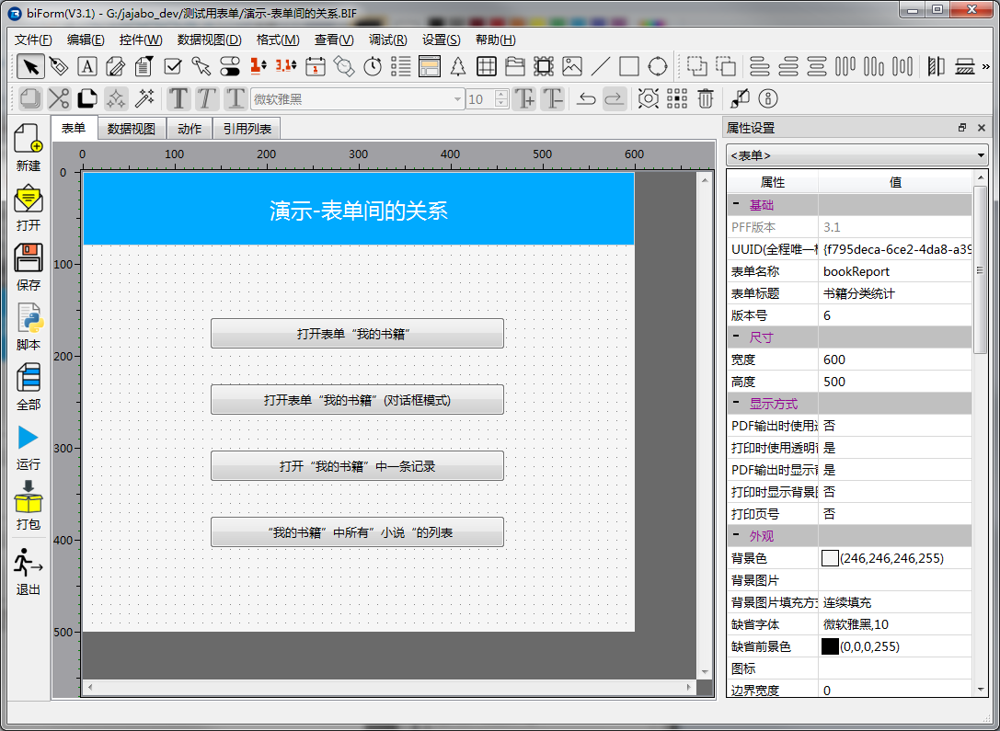
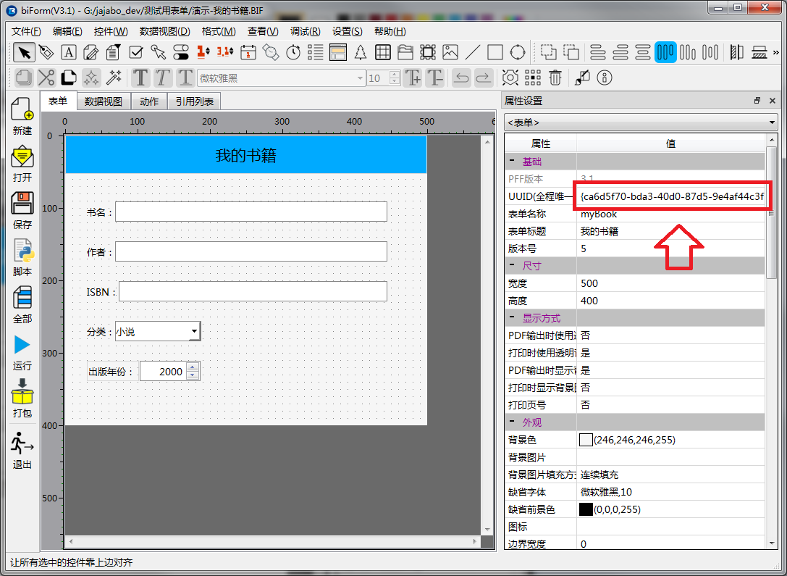
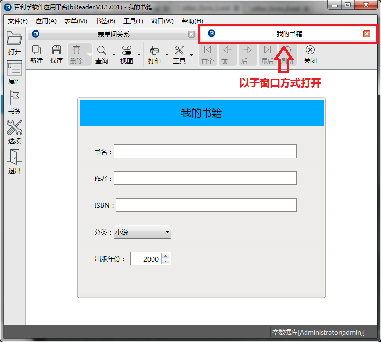
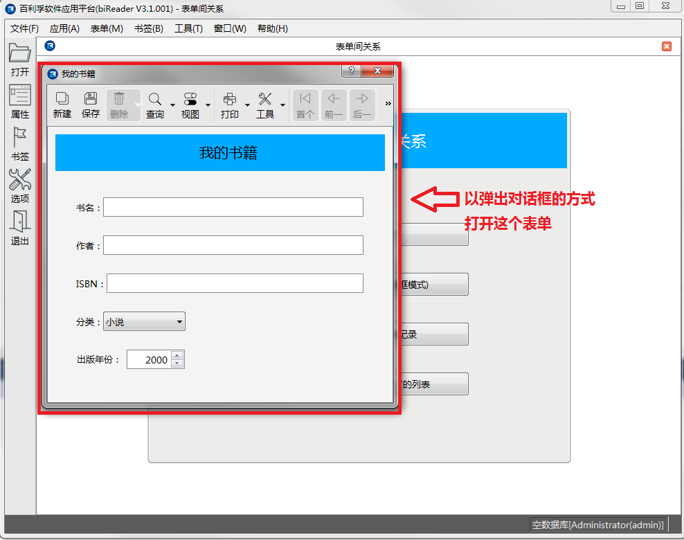

# 打开其它表单

有时我们会需要在使用一个表单时打开另外一个表单。

我们通过“表单间关系”这个表单用来演示这种情况。

这个表单的设计界面如下所示：



## 第一种方式：以子窗口的方式打开另外一个PFF表单

在按钮 **打开表单"我的书籍"** 的clicked事件中写入脚本：

``` python
	pub.openPFF("{ca6d5f70-bda3-40d0-87d5-9e4af44c3f7e}")
```

其中 **{ca6d5f70-bda3-40d0-87d5-9e4af44c3f7e}** 是“我的书籍”的表单UUID。

这是表单**我的书籍**的一个属性，如下图所示：



运行后的结果，如下图所示：



## 第二种方式：以弹出对话框方式打开另外一个PFF表单

我们也可以将“我的书籍”以弹出对话框的方式打开，在按钮 **打开表单"我的书籍"（对话框模式）** 的clicked事件中写入脚本：

``` python
	pub.popupPFF("{ca6d5f70-bda3-40d0-87d5-9e4af44c3f7e}")
```

这段脚本运行后，“我的书籍”这个表单会以弹出对话框的模式显示，而不是在主窗口中以子窗口方式显示：


