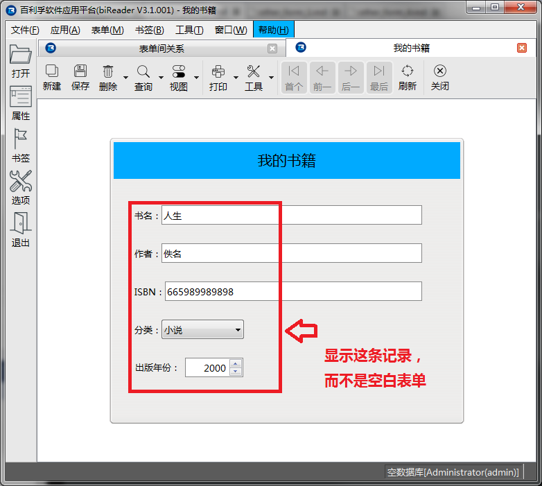

# 打开其它表单并转到某一条记录

有时我们需要转到其它表单，并显示某条指定的记录。

下面的脚本用来演示如何跳转到UUID值最大的那条记录。

在按钮 **打开"我的书籍"中一条记录** 的clicked事件中写入脚本：

``` python
	db=this.form.database()
	re=db.execute("select max(UUID) from "+db.getRealTableName('t_book'))
	if len(re)==0:
		pub.infoMsgBox(this.form.caption,'没有查询到记录！')
		return
	if len(re[0][0])==0:
		pub.infoMsgBox(this.form.caption,'没有查询到记录！')
		return
	pub.openRecord("{ca6d5f70-bda3-40d0-87d5-9e4af44c3f7e}",re[0][0])
```

pub.openRecord函数的第一个参数是表单的UUID，第二个参数是记录的UUID。

运行以上脚本，会打开**我的书籍**这个表单，与openPFF函数不同的是，打开表单后会直接跳转到指定UUID对应的那条记录，并在表单界面上显示记录的内容。如下图所示：




