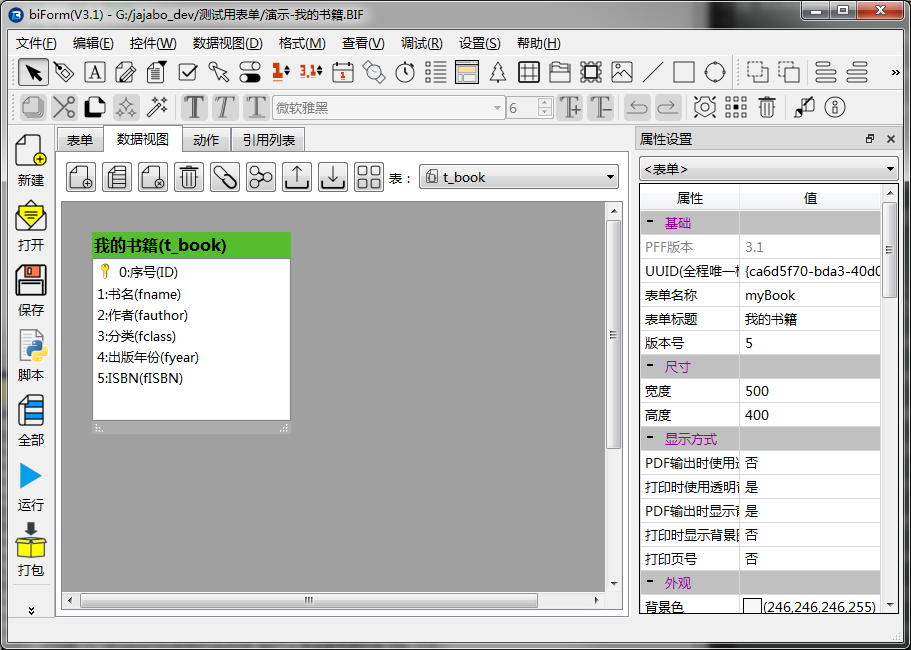
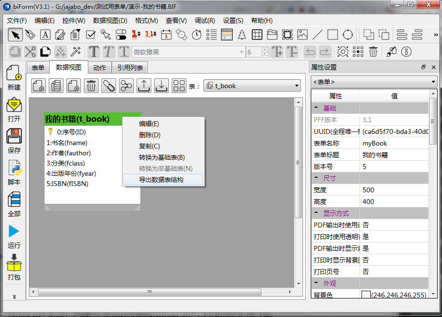
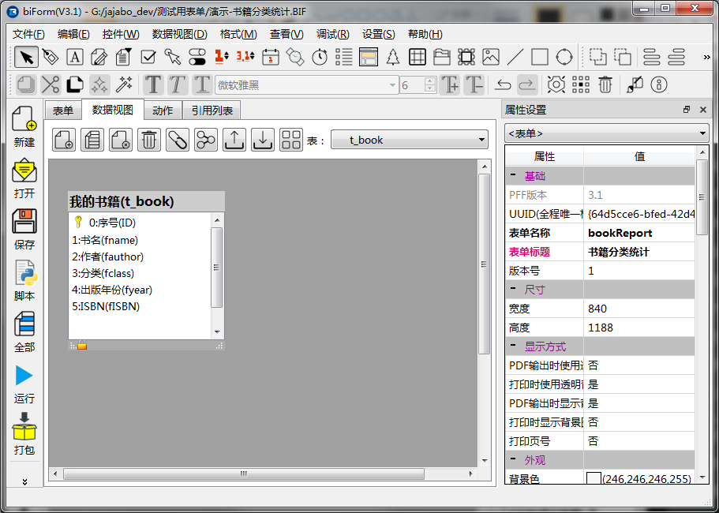
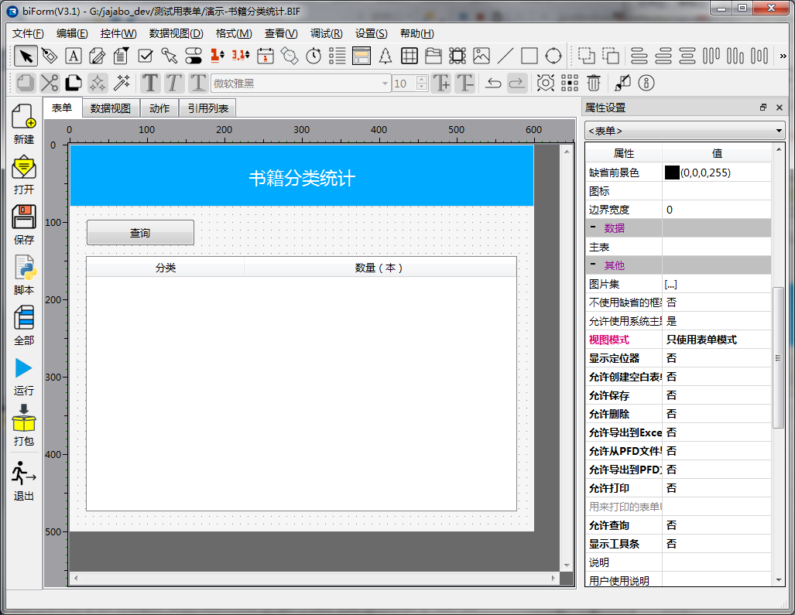
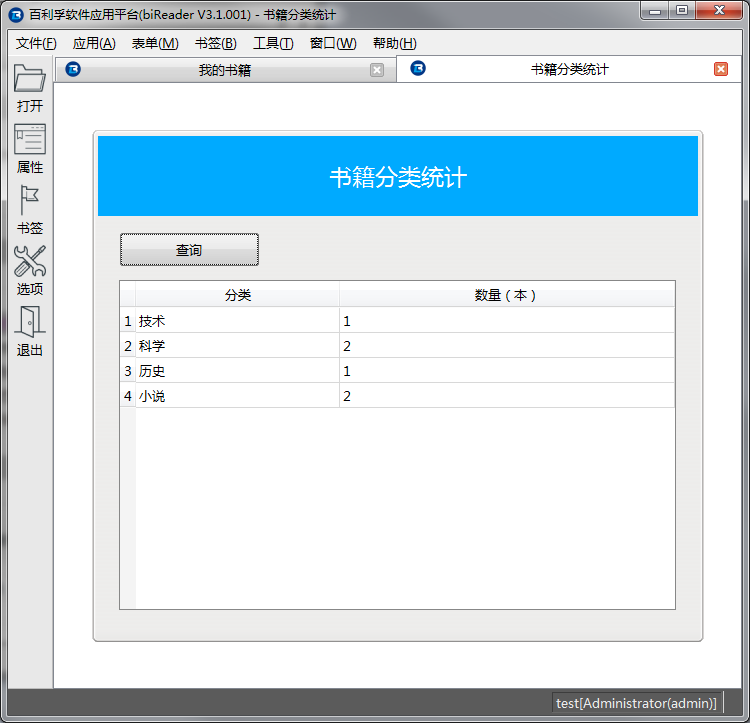

# 共享数据

比如在我们给的例子中，我们做了一个“我的书籍”表单，我们可能还希望再做一个表单“书籍分类统计”，统计一下各类书籍的数量。表单“我的书籍”和表单“书籍分类统计”之间是共享数据的关系。

从 biReader 的角度来讲，它们之间的关联关系是通过**共享数据表**实现的。

还记得吗？表单**我的书籍**中的数据视图是这样的：



表单**我的书籍**的功能就是对表 **t_book** 进行增删改查操作。

我们现在还需要做一个表单**书籍分类统计**，通过查询**t_book**中的记录进行统计，生成报表。

## 导出数据表结构

在“我的书籍”这个表单中，将t_book的设计导出。

方法是在“我的书籍(t_book)”上点击鼠标右键，在弹出菜单中选择“导出数据表结构”。



## 导入数据表结构

新建一个表单“书籍分类统计”，在数据视图分页中使用“导入数据视图”。

需要注意的是导入后**t_book**表缺省是“基础表”的状态，与在“我的书籍”中的属性不一样。因为这个表单只是用于查询统计，所以需要设置t_book表为基础表，这里就保持缺少状态不用修改了。

导入后的数据视图：



## 设计表单、写入脚本

设计好表单样式，具体操作就不详述了，设计后如下图所示：



在“查询”按钮 buQuery 的事件 clicked 中写入脚本，查询**t_book**中的记录，得到统计结果并显示在表格中：

``` python
def buQuery_clicked():
	'''这段脚本在点击这个控件时被调用。'''
	db=this.form.database()
	this.table.setListBySQL("select fclass,count(*) "+\
		" from "+db.getRealTableName('t_book')+\
		" group by fclass")
	return None
```

要注意SQL语句中不能直接使用表名t_book，而是应该用**db.getRealTableName('t_book')**获取实体表的表名。

## 打包为PFF文件

这两个表单是独立的，所以它们各自打包生成一个PFF文件。

在 biReader 中，两个表单的整合是自动完成的，不需要用户干预或设置，因为在设计阶段已经决定了它们之间的关系。

如下图，就是运行这个表单的结果：



即使没有“我的书籍”这个表单，“书籍分类统计”也可正常运行，只是查询的结果可能是空的。这只是因为没有数据，它的运行并不依赖于“我的书籍”这个表单。

从数据角度来讲，它也并非完全依赖“我的书籍”这个表单提供数据。我们可以做一个与本例中完全不同的录入“t_book”记录的表单，只要是使用**t_book**这个表，就也可以为“书籍分类统计”提供数据。

值得注意的是，只有数据表的UUID相同，biReader才会认为它们是同一个表，否则它们之间不会产生关联关系。

如果两个表单的数据表**名称一样，但UUID不一样**，在biReader中，它们将分别使用不同的数据表。

如果两个数据表的**名称不一样，但UUID一样**，在biReader中，它们被认为是同一个数据表。

## 总结一下，表单之间是如何共享数据的

- PFF表单在运行时并不依赖于其它表单，它们可以分别独自运行

- 两个PFF表单可以通过设置同一个表（UUID相同），实现两个表单之间共享数据的目的

- 一个PFF表单可以由多个PFF表单提供数据，同样，一个PFF表单也可以为多个PFF表单提供数据，它们之间的关系是弱相关的

- 只有UUID相同的两个表才会被 biReader 认为是同一个数据表


