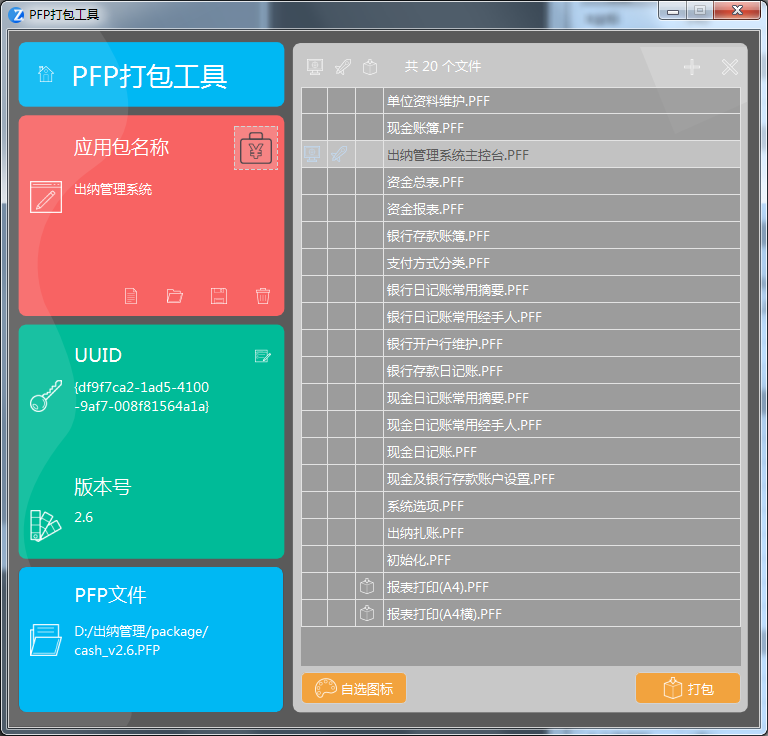
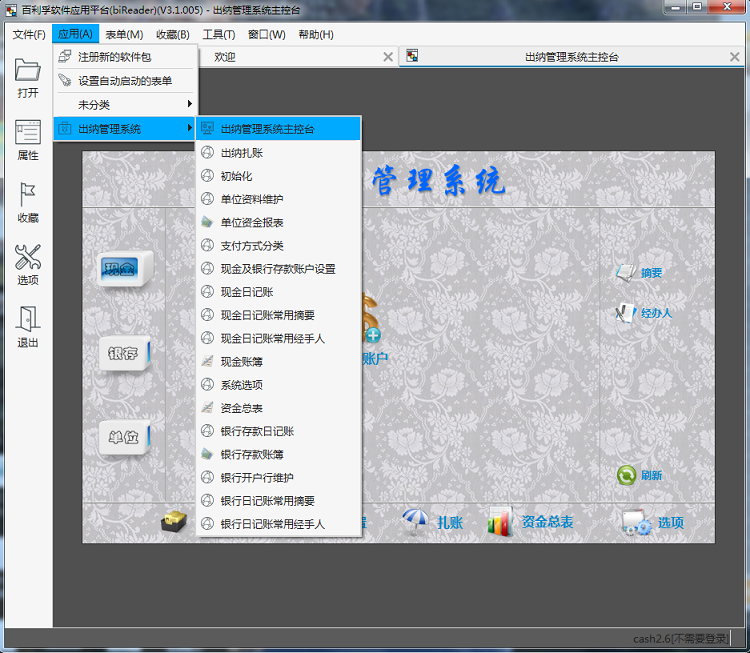
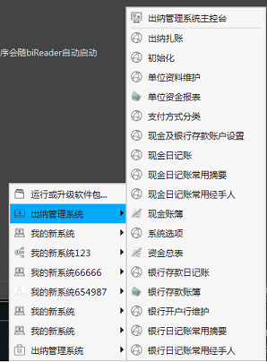
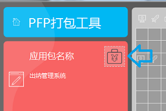
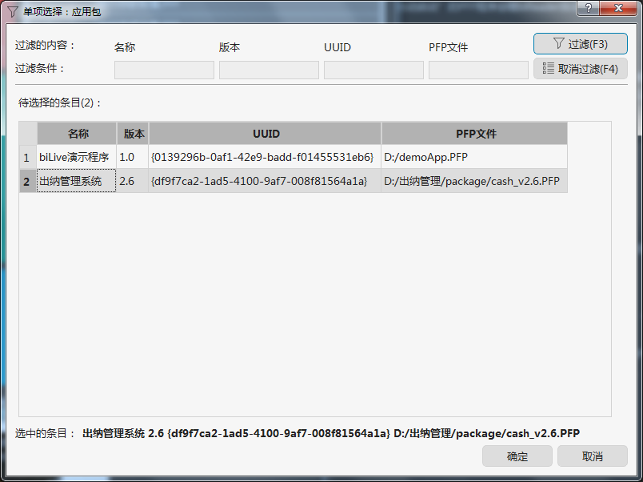

# PFP打包工具

PFP打包工具用来将多个PFF程序打包成PFP文件，以便可以一起发布。运行时环境会将PFP包做为一个完整的“应用系统”提供一些额外的管理功能。

## 下载地址

点此下载： [PFP打包工具下载地址](https://www.bilive.com/site_media/media/tools/PFPtools.PFF) 
 
## 如何使用

“PFP打包工具”本身也是一个PFF程序，可以使用 biReader 或 智应软件中心来运行它。

1、安装“智应软件中心”，双击“PFPtools.PFF”，或通过任务栏菜单提供的功能执行这个PFF程序

2、安装biReader，在菜单中使用“文件”-“打开”，选择“PFPtools.PFF”

启动后，需要先设置应用包的一些信息，信息可以保存下来方便以后重复使用。设置好信息后，点击“打包”按钮就可以生成PFP文件。

## PFP应用包的作用

一个PFF程序通常功能单一，一个复杂的应用程序或系统，通常需要由多个PFF程序组合完成。比如典型的如上图所示，一个功能完整的“出纳管理系统”由20个PFF程序组合而成。

用户需要使用这个系统时，可以分别下载这些PFF程序文件，一个一个地在运行时环境中打开运行。但显然这样操作很是低效。

PFP应用包将所有文件打包一起发布，可以简化用户第一次使用时的安装过程。

biLive跨平台应用程序的运行时环境（如“biReader”和“智应软件中心”）会为PFP应用提供额外的功能和管理工具。不同的运行时环境可能会提供不一样的功能和管理工具。

比如在biReader中注册了 cash_2.6.PFP 这个应用包之后，在主菜单上会提供这个应用包的菜单，如下图所示：

在智应软件中心的任务栏快捷菜单中也会提供类似的菜单，如下图所示：

## 操作步骤

### 1、设置应用包各项信息

- 应用包名称

设置应用包的名称，这个名称会出现在运行时环境中。建议使用对最终用户友好的名称。

- UUID

UUID用于全程唯一地代表一个应用包。UUID对运行时环境识别应用包至关重要，所以一定要注意。

以“出纳管理系统”为例，上图所示UUID是“{df9f7ca2-1ad5-4100-9af7-008f81564a1a}”。如果再创建一个新的应用包，UUID改为“{2d98cebc-96cd-4f81-bb43-1bc50b22db0c}”。即使这两个应用包其它的设置一模一样，在运行时环境中，也会认为这是两个应用包，在菜单中会出现两个“出纳管理系统”，如下图中所示。

如果这两个包包含相同的PFF程序（以PFF的UUID来判断），在运行时环境中，不管是从哪个应用包的菜单项进行调用，实际上运行的是同一个PFF程序。所以，可以灵活掌握UUID对此的影响，注意在创建PFP应用包时灵活掌握。

创建一个“应用包”，会自动生成一个UUID，也可以点击左侧的按钮重新生成一个。如果想要修改，可以使用UUID板块右上角的修改按钮。手工修改，需要注意UUID的格式，不要直接使用“1”，“2”这种简单化的内容。发布者需要能保证不同的发布者发布的应用包都不要产生UUID重复的情况，否则在运行时环境中会因为UUID重复与其他应用包互相混淆。手工修改只建议用于需要使用已经发布过的UUID来创建或复制一条新记录的情况，比如想为同一个应用包的每个版本分别建一条新记录。

- 版本号

设置应用包的版本号。

虽然理论上版本号可以使用任意的样式，但为了运行时环境能更好地判断版本号的大小 ，所以这个打包工具只允许使用“X.X”（X只能是数字）这样的格式。

如果整个应用包要升级，可以将版本号修改为“大于”原来的版本号后，重新打包。这样在运行时环境中，用户使用新的应用包时，会自动进行升级。如果版本号低于原来已用的版本号，运行时环境通常是会拒绝处理的。

- PFP文件

设置最后要生成的PFP文件目录和文件。

- 图标

可以给应用包设置一个图标，如果不设置，运行时环境会使用缺省的图标。

图标可以从 biLive 运行时引擎提供的缺省图标集中选择，如下图点击“应用包名称”右侧的图片可以进行设置。

也可以使用外部的图片文件进行设置，如下图所示点击“自选图标”即可。

### 2、设置应用包包含的PFF程序清单

右侧列表用于管理PFP应用包中包含的PFF程序清单。PFF程序提供了几个发布选项，双击表格中第一列和第三列进行设置。设置后会影响在运行时环境中的运行状态。分别是：

1）主控台

设置为“主控台”的PFF程序通常在运行时环境的菜单中会被列在最上方。在biReader中缺省情况下会随程序自动启动，但用户可以自己调整。一个应用包只能设置一个主控台。通常用于主控台的PFF程序会提供访问本应用包的其它程序的导航菜单，比如本例中“出纳管理系统”的主控台是这样的：

2）自动启动

设置为“自动启动”的PFF程序会随biReader自动启动，但用户可以自己进行调整。目前我们发布的智应软件中心会忽略这一选项。

3）隐藏

隐藏的PFF程序在运行时环境中的菜单中是看不到的，但可以被其它PFF程序通过Python脚本调用。这类PFF程序通常用于提供弹出对话框、用于打印输出的界面处理等辅助功能，用户不需要自己手动启动这些程序，因此可以隐藏之。

### 3、打包！

以上信息设置好后，点击“打包”按钮就可以了。

## 应用包信息维护

应用包的设置可以保存下来供以后使用。本工具可以管理多个应用包设置。

上图所示，各个按钮分别是“新建”、“打开”、“保存”、“删除”。

点击“打开”按钮，可以显示所有已经保存的应用包的设置：

数据会保存在后台数据库里。biReader使用的数据源可以由用户进行设置，在启动时的登录界面可以查看和设置。智应软件中心的数据源是工作目录下的 readerdb.db3 文件。其它运行时环境则参考相关的技术文档。

## 应用包的升级和扩展

PFP应用包对PFF程序的管理是松散的、可扩展性很强的。体现在以下几个方面：

1）即使去掉注册的应用包的信息，PFF程序在运行时环境中也还是可以继续使用的；

2）用户随时都可以使用其它PFF程序来扩展与此应用包相关的功能。比如以“出纳管理系统”为例，用户可以在应用包之外，另外再注册一个“资金日报.PFF”的程序，读取“出纳管理系统”中的数据来生成报表。只是“资金日报.PFF”不会出现在“出纳管理系统”这个应用包相关的菜单中，但并不影响它的使用。这样任何开发者都能很方便地对原来的系统进行扩展和二次开发；

3）要扩展和升级PFP应用包的已有功能，可以在应用包信息中添加或修改PFF清单后，重新打包。也可以单独发布其中某个PFF程序的新版本文件给用户，而不必每次都要完整地打包发布完整的PFP应用包；

4）PFP应用包可以很方便地为不同用户提供个性化的发行版。在很多情况下，不同的用户对同一个系统有不同的需求，比如需要定制个性化的主控台、个性化报表、套打样式等。基于biLive独特的应用框架，开发者可以为不同用户开发满足他们个性化需求的PFF程序，与满足共性需求的PFF一起，方便地组合出不同的应用包分别发布给不同的用户。这样既能满足不同用户对系统的个性化需求，也能充分复用通用的功能。
