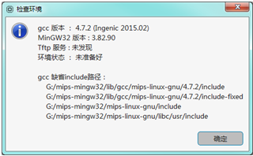

# 智龙集成开发环境

智龙集成开发环境是针对智龙1C系列开发板的一个集成式开发环境。本文统一简称为IDE或智龙IDE。

智龙开发板由[南京龙众创芯电子科技有限公司](http://www.loongmasses.cn/)设计开发。

```
南京龙众创芯电子科技有限公司
客服：4008571799
联系人：石南
手机&微信： 13776573997 
电子邮箱：loongsonclub@126.com
```

## 下载和安装

智龙IDE支持多个Linux发行版和Windows多个版本，如Loongnix、UOS、银河麒麟、Deepin、Ubuntu、Windows 7/8/10，并支持多种CPU架构，如X86、Mips、LoongArch等。

访问 [智龙IDE下载中心](/smartloong/download) 下载安装包。

Windows下使用 .msi 文件进行安装，建议最好不要装在C盘。安装前检查是否有安全软件、防火墙等限制安装，如果有，先停止相关服务。

Windows下如果没有安装过VC++ Redistributable，需要先安装一下。

Linux版本如果是 deb 包，用以下命令进行安装：

```
sudo dpkg –i deb文件名
```

如果是rpm包，用：

```
sudo rpm -ivh 文件名 --nodeps --force
```

安装后，或程序启动时提示“不能启动：连接数据库失败”等信息，是因为安装目录没有访问权限造成的，可以修改目录的访问权限或卸载后选择其它安装目录。

## 使用前准备

IDE使用前需要先准备好相关环境，所需文件及安装设置方式请参考《嵌入式Linux系统设计及应用—基于国产龙芯SoC》一书。

### 1、交叉编译工具
IDE没有自带交叉编译工具，所以需要自己安装。

### 2、tftp服务
安装好后，在windows下需启动tftpd32.exe程序，并设置好目录。在Linux下也需先启动 tftp server 服务。

### 3、串口
Windows下可能需要先安装驱动。Linux下需要将开发板连上 USB 口之后，查看 /dev 目录下是否有 ttyUSB* 文件，如果当前用户不在dialout 组里，需要先把当前用户加到 dialout 组里去，否则程序对这个设备没有访问权限就无法连接成功。

### 4、网络设置
开发板与上位机需要在同一网段，需要先进行设置，否则上传文件会失败。

### 5、检查环境

环境准备好后，用IDE中主菜单“工具”－“检查环境”，检查一下是否都已准备好。如果没准备好，显示的信息类似下图：



如果已准备好，显示的信息类似下图：


## 使用智龙IDE进行嵌入式开发

详细的用户使用说明： [智龙IDE用户操作手册](https://www.bilive.com/site_media/media/setup/smartloong/help/smartloong_1.0.005_manual.pdf)  。

## 扩展组件（插件）

智龙IDE使用了 [biLive跨平台桌面应用框架](/bilive/bilive_framework) 做为插件框架，因此具有很强的可扩展性。

访问 [智龙IDE扩展组件中心](smartloong/plugins) 了解关于插件的详细信息，以及[如何为智龙IDE开发扩展组件](smartloong/dev_howto)。

