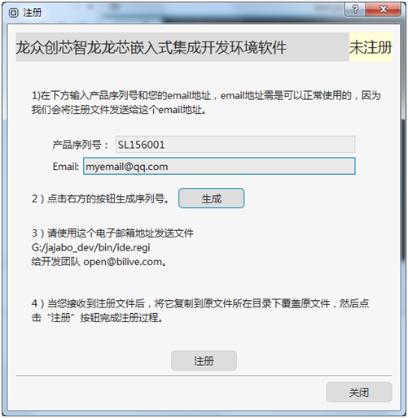

# 智龙IDE注册激活流程

智龙IDE注册激活后可以使用更丰富的功能。

## 注册流程

在智龙IDE主菜单中选择“帮助”-“注册”。在注册界面中按提示，输入“产品序列号”和“电子邮箱”：

点击“生成”按钮后，将生成的 ide.regi 文件按提示发送给开发团队。

开发团队在确定相关信息后，会将生成的注册码，存于 ide.regi 文件中再发送回用户输入的电子邮箱。

收到邮件后，覆盖原目录下原文件，重新启动智龙IDE即可完成注册。

## 注意事项

- ide.regi 文件是与硬件环境绑定的，如果换了机器或者重装了其它操作系统，需要重新注册；

- 一个“产品序列号”只能使用一次；

- ide.regi 请保留好备份，重新系统或重装智龙IDE还可以继续使用；

- 要注意使用自己正常使用的电子邮箱，注册时会核对电子邮箱地址，如果是无效的地址，可能会拒绝进行注册；

- “产品序列号”是随智龙开发板发放的，请检查产品外包装、说明书等，不清楚的可以联系开发板供应商；

- 有些电子邮箱可能会拒收开发团队的邮件，发回的注册文件也有可能使用其它邮箱发送。如果一段时间内没有收到回复，请检查是否电子邮件被拦截了。
